# Pipeline for "Recombination suppression and selection affect local ancestries in genomes of a migratory songbird"

## Local PCA

Here I show how local PCA was run with three example chromosomes, 12, 20, and 21, which are listed in `local_PCA/list/chromosomes/list`

```bash
dirbase=$PWD/local_PCA
dirin=$dirbase/input
dirvcf=$dirin/vcf
dirtab=$dirin/table
dirlist=$dirbase/list
dirout=$dirbase/output
dirlocalpca=$dirout/local_PCA
dirlocalpcamds=$dirout/local_PCA_MDS
dirscripts=$dirbase/scripts

```

Download filtered VCF files for chromosomes 12, 20, 21.

```bash


```


Make list of sites from VCF.
```bash
while read chr
do
        bcftools query -f '%POS\n' $dirvcf/$chr.vcf.gz > $dirtab/$chr.sites.list
done <$dirlist/chromosomes.list

```

Make genotype table from VCF.
```bash

while read chr
do
        sbatch $dirscripts/vcf2table.sh $dirvcf/$chr.vcf.gz $dirtab/$chr.table
done <$dirlist/chromosomes.list


```


Run local PCA.
[`local_PCA/scripts/local_PCA.sh`](local_PCA/scripts/local_PCA.sh) submits [`local_PCA/scripts/local_PCA.R`](local_PCA/scripts/local_PCA.R) via slurm.
Check [`local_PCA/scripts/local_PCA.sh`](local_PCA/scripts/local_PCA.sh) and [`local_PCA/scripts/local_PCA.R`](local_PCA/scripts/local_PCA.R) for detail.

```bash
module load R/3.5.3

while read chr 
do
        sbatch $dirscripts/local_PCA.sh $dirtab $dirtab $dirlocalpca $dirlocalpcamds $dirlist $chr $dirscripts
done <$dirlist/chromosomes.list


```


Concatenate the output for the three chromosomes.
```bash

while read chr
do
        cat $dirlocalpcamds/local_PCA_MDS_$chr.txt
done <$dirlist/chromosomes.list | awk 'NR==1{print $0}NR>1{if($1!="chr")print $0}' > $dirlocalpcamds/local_PCA_MDS_3_chromosomes.txt


```


Get threshold of MDS values and plot MDS distribution.
```bash

Rscript $dirscripts/plot_local_PCA_MDS_distribution.R --input $dirlocalpcamds/local_PCA_MDS_3_chromosomes.txt --output $dirlocalpcamds/local_PCA_MDS_3_chromosomes --chrlist $dirlist/chromosomes.list

```


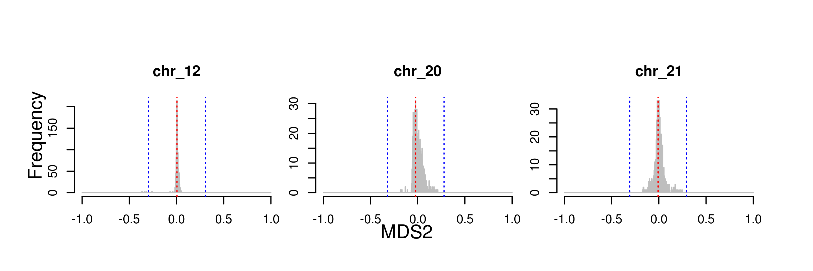


Plot MDS1 vs MDS2.

```bash

Rscript $dirscripts/plot_local_PCA_MDS_MDS1-vs-MDS2.R --input $dirlocalpcamds/local_PCA_MDS_3_chromosomes.txt --thre $dirlocalpcamds/local_PCA_MDS_3_chromosomesthreshold.txt --output $dirlocalpcamds/local_PCA_MDS --chrlist $dirlist/chromosomes.list

```
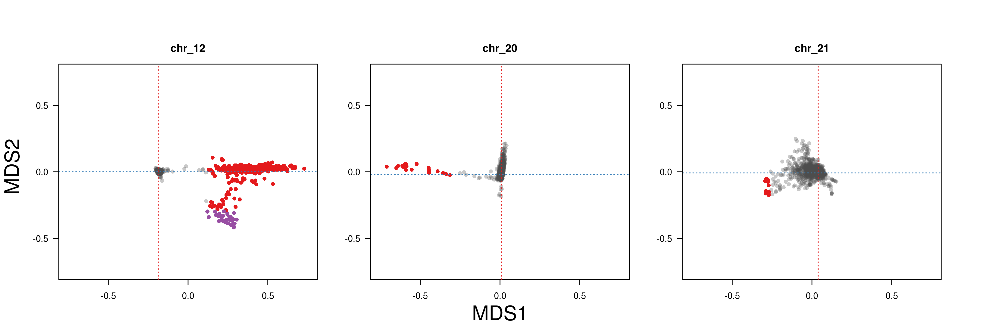


Get coordinates of outlier windows.
```bash
Rscript $dirscripts/getOutliers.R --input $dirlocalpcamds/local_PCA_MDS_3_chromosomes.txt --thre $dirlocalpcamds/local_PCA_MDS_3_chromosomesthreshold.txt --output $dirlocalpcamds/local_PCA_MDS --chrlist $dirlist/chromosomes.list

```

Make Manhattan plots.
```bash
Rscript $dirscripts/plot_local_PCA_MDS_manhattan.R --input $dirlocalpcamds/local_PCA_MDS_3_chromosomes.txt --thre $dirlocalpcamds/local_PCA_MDS_3_chromosomesthreshold.txt --bed $dirlocalpcamds/local_PCA_MDS_outlier.bed --output $dirlocalpcamds/local_PCA_MDS --chrlist $dirlist/chromosomes_length.list

```

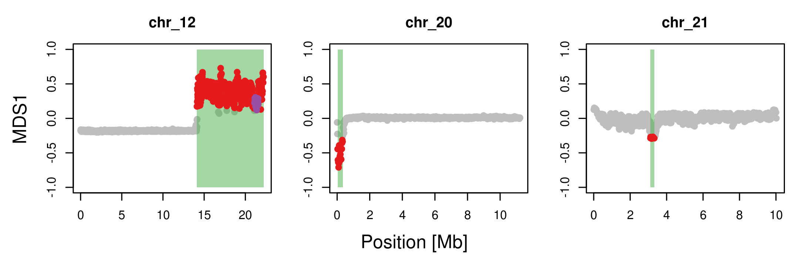

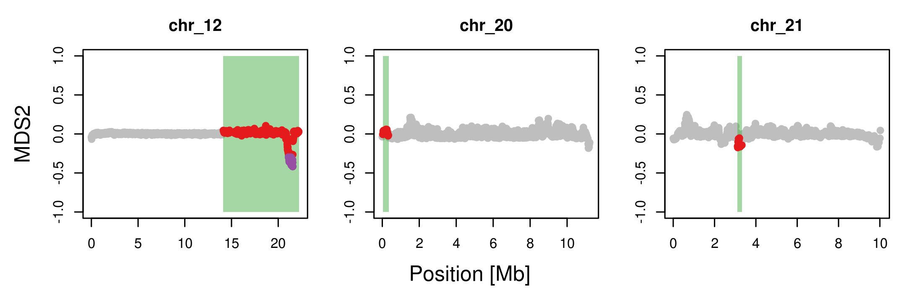


## PCA in local PCA outliers


Here I show how PCA was run for three local PCA outlier regions of chromosomes 12, 20, and 21, which represent class-1, 2, and 3 outliers.

```bash
dirbase=$PWD/PCA
dirin=$dirbase/input
dirvcf=$dirin/vcf
dirlist=$dirbase/list
dirout=$dirbase/output
dirscripts=$dirbase/scripts

```

Link VCF files from `local_PCA/input/vcf` and index them.

```bash
ln $dirbase/../local_PCA/input/vcf/*vcf.gz $dirvcf

while read chr
do
        echo $chr
        bcftools index $dirvcf/$chr.vcf.gz
done<$dirlist/chromosomes.list


```

Copy BED file for coordinates of local PCA outliers of chromosomes 12, 20, and 21.

```bash
ln $dirbase/../local_PCA/output/local_PCA_MDS/local_PCA_MDS_outlier.bed $dirlist

```

Extract SNPs within the local PCA outlier regions.

```bash

while read chr from to
do
        bcftools view -O z -r $chr:$from-$to -S $dirlist/blackcap_id.list $dirvcf/$chr.vcf.gz | vcftools --gzvcf - --max-missing 0.9 --recode --recode-INFO-all -c |bgzip > $dirvcf/${chr}_${from}_$to.vcf.gz
done < $dirlist/local_PCA_MDS_outlier.bed

```

Run `PLINK` for PCA.
```bash

while read chr from to
do
        sbatch $dirscripts/plink_pca.sh  $dirvcf/${chr}_${from}_$to $dirout/${chr}_${from}_$to
done < $dirlist/local_PCA_MDS_outlier.bed

```


Plot PCA results.
```bash

Rscript $dirscripts/plot_pca_per_outlier.R --dirpca $dirout --poplist $dirlist/id_spp_pop_site_pheno.tsv --outlierlist $dirlist/local_PCA_MDS_outlier.bed --chrlist $dirlist/chromosomes.list

```

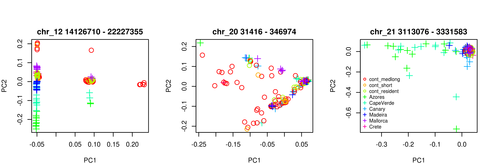


Get Eigenvalues.

```bash

while read chr pos1 pos2
do
        awk -v chr=$chr -v pos1=$pos1 -v pos2=$pos2 'BEGIN{printf "%s %s %s ", chr,pos1,pos2}{printf "%s ",$1}END{print ""}' $dirout/${chr}_${pos1}_${pos2}.eigenval
done < $dirlist/local_PCA_MDS_outlier.bed | awk 'NR==1{printf "%s %s %s ","chr","pos1","pos2";for(i=4;i<=NF;i++){printf "%s ","PC"i-3};print ""}{print $0}'> $dirout/eigenvalues.txt


```

Plot Eigenvalues.

```bash

Rscript $dirscripts/plot_eigenval.R --dirpca $dirout 

```

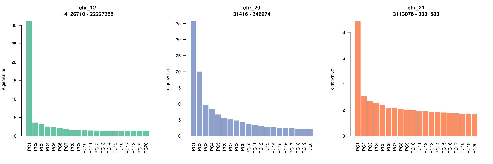


## Population genomics of class-1 genomic islands (empirical)

Here I demonstrate how population genomic analyses were performed on class-1 genomic islands, using chromosome 12 as an example.

```bash

dirbase=$PWD/class-1
dirin=$dirbase/input
dirvcf=$dirin/vcf
dirmask=$dirin/mask
dirmultihetsep=$dirin/multihetsep
dirlist=$dirbase/list
dirout=$dirbase/output
dirscripts=$dirbase/scripts

```

### Heterozygosity


Make link to VCF of chromosome 12, as an example chromosome harbouring a class-1 genomic island.
```bash
ln $dirbase/../PCA/input/vcf/chr_12.vcf.gz  $dirvcf
ln $dirbase/../PCA/input/vcf/chr_12.vcf.gz.csi  $dirvcf

```

Get coordinates of class-1 genomic island of chromosome 12.

```bash

awk -v OFS="\t" '$1=="chr_12"{$1=$1;print $0}' $dirbase/../local_PCA/output/local_PCA_MDS/local_PCA_MDS_outlier.bed > $dirlist/class-1.chr_12.bed

```

Make list of individuals with AA, AB, and BB. 

```bash

awk '$3<0{print $1}' $dirbase/../PCA/output/chr_12_14126710_22227355.eigenvec > $dirlist/chr_12.AA.list
awk '$3>0.15{print $1}' $dirbase/../PCA/output/chr_12_14126710_22227355.eigenvec > $dirlist/chr_12.BB.list
awk '$3>0&&$3<0.15{print $1}' $dirbase/../PCA/output/chr_12_14126710_22227355.eigenvec > $dirlist/chr_12.AB.list

```


Compute heterozygosity.
```bash

while read chr pos1 pos2
do
        for geno in AA AB BB
        do
                while read id
                do
                        # echo $id $chr $geno
                        bcftools query -f '[%GT ]\n' -r $chr:$pos1-$pos2 -s $id $dirvcf/$chr.vcf.gz |sed 's@0/0@0@g;s@0|0@0@g;s@1/1@0@g;s@1|1@0@g;s@0/1@1@g;s@0|1@1@g;s@1|0@1@g;s@\./\.@@g;s@\.|\.@@g' | awk -v chr=$chr -v geno=$geno -v id=$id '{i++;s+=$1}END{print chr,geno,id,s,i,s/i}'
                done<$dirlist/${chr}.$geno.list
        done 
done < $dirlist/class-1.chr_12.bed | awk 'BEGIN{print "chr","geno","id","n.het","n.sites","het"}{print $0}' > $dirout/chr_12.het.txt


```

Plot heterozygosity for AA, AB, and BB.

```bash

Rscript $dirscripts/plot_het.R --dir $dirout

```

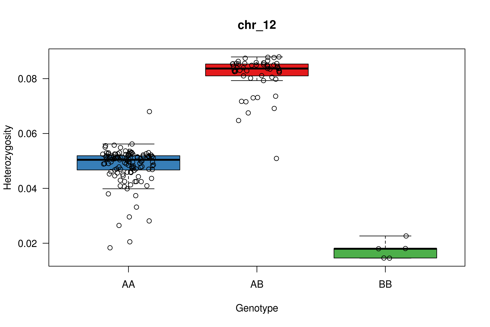

### F<sub>ST</sub>, d<sub>XY</sub> and π

Copy `chromosomes_length.list`.

```bash
cp $dirbase/../local_PCA/list/chromosomes_length.list $dirlist

```


Make [`chr_12_IDgeno.list`](class-1/list/chr_12_IDgeno.list).

```bash

while read chr pos1 pos2
do
        for geno in AA BB
        do
                awk -v geno=${chr}.${geno} '{print $1,geno}' $dirlist/${chr}.$geno.list 
        done |awk 'BEGIN{print "sample","population"}{print $0}' > $dirlist/${chr}_IDgeno.list
done<$dirlist/class-1.chr_12.bed

```

Tabix input VCF.
```bash
tabix $dirvcf/chr_12.vcf.gz

```


Run PopGenome.
[`class-1/scripts/PopGenome_windowstats.sh`](class-1/scripts/PopGenome_windowstats.sh) submits [`class-1/scripts/PopGenome_windowstats.R`](class-1/scripts/PopGenome_windowstats.R via slurm).
Check [`class-1/scripts/PopGenome_windowstats.sh`](class-1/scripts/PopGenome_windowstats.sh) and [`class-1/scripts/PopGenome_windowstats.R`](class-1/scripts/PopGenome_windowstats.R) for detail.

```bash

win=10000
while read chr pos1 pos2
do
sbatch $dirscripts/PopGenome_windowstats.sh \
$dirvcf/$chr.vcf.gz \
$dirlist/chromosomes_length.list \
$chr \
$dirlist/${chr}_IDgeno.list \
$win \
$dirout/blackcap.$chr.AA.BB
done<$dirlist/class-1.chr_12.bed


```


Plot the results.
```bash
module load R/3.5.3
Rscript $dirscripts/plot_windowstats_class-1.R --dir $dirout --bedfile $dirlist/class-1.chr_12.bed

```

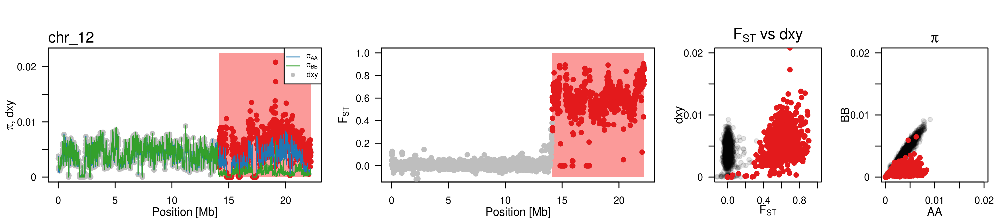


Run permutation tests.

```bash

while read chr pos1 pos2
do
        if [ $chr != "chr_6" ];then
                Rscript $dirscripts/permutation_windowstats.R --chr $chr --pos1 $pos1 --pos2 $pos2 --n 10000 --pifile $dirout/blackcap.$chr.AA.BB_pi_PopGenome10kb.txt --dxyfile $dirout/blackcap.$chr.AA.BB_dxy_PopGenome10kb.txt --fstfile $dirout/blackcap.$chr.AA.BB_FST_PopGenome10kb.txt
        fi
done<$dirlist/class-1.chr_12.bed | awk 'BEGIN{print "chr","pos.from","pos.to","p.val_piAA","p.val_pi.BB","p.val_dxy","p.val_FST","p.val_pi1-pi2"}{print $0}' | sed 's/ /,/g' > $dirout/permutation_windowstats_class1.csv

```

The result is written in [`class-1/output/permutation_windowstats_class1.csv`](class-1/output/permutation_windowstats_class1.csv).


### Coalescent time (empirical)

Samples used for coalescent time analysis are listed in [`class-1/list/chr_12.AA.4samples.list`](class-1/list/chr_12.AA.4samples.list), [`class-1/list/chr_12.AB.4samples.list`](class-1/list/chr_12.AB.4samples.list) and [`class-1/list/chr_12.BB.4samples.list`](class-1/list/chr_12.BB.4samples.list).


Mask files were created using `generate_multihetsep.py` following <https://github.com/stschiff/msmc-tools> from alignment files (BAM) and reference file (FASTA).
Precomputed mask files are found in [`class-1/input/mask/`](class-1/input/mask/).


Split VCF file into individuals.

```bash

for geno in AA AB BB
do
        while read id
        do
                echo $geno $id
                bcftools view -s $id -M2 -m2 $dirvcf/chr_12.vcf.gz | vcftools --vcf - --mac 1 --recode -c | bgzip > $dirvcf/$id.chr_12.vcf.gz
        done < $dirlist/chr_12.$geno.4samples.list 
done

```


Make `run_generate_multihetsep_chr_12.<genotype>.sh` files in [`class-1/scripts/run_generate_multihetsep/`](class-1/scripts/run_generate_multihetsep/).

```bash
$dirscripts/write_run_generate_multihetsep_per_group.sh $dirbase

```


Submit them via slurm to make [multihetsep files](class-1/input/multihetsep/).

```bash

for geno in AA AB BB
do
        sbatch $dirscripts/run_generate_multihetsep/run_generate_multihetsep_chr_12.$geno.sh $dirmask $dirvcf $dirmultihetsep
done

```


Get 0-based index of samples for `MSMC2-decode`.

```bash
for geno in AA AB BB
do
        awk 'BEGIN{c=0}{c++;print $1,2*c-2,2*c-1}' $dirlist/chr_12.$geno.4samples.list > $dirlist/chr_12.$geno.4samples.idx.list
done

```


Based on recommendation of [`MSMC2-decode`](https://github.com/stschiff/msmc/blob/master/guide.md#estimating-the-local-tmrca-states), mutation rate is defined as a half of heterozygosity (Watterson's theta) for mutation rate and 80% of it for recombination rate.
Watterson's theta was computed using chromosome 20, and was 0.00454362.

```bash
mu=`awk -v m=0.00454362 'BEGIN{print m/2}'`
rec=`awk -v mu=$mu 'BEGIN{print 0.8*mu}'`

for geno in AA AB BB
do
        while read id idx1 idx2
        do
                decode -m $mu -r $rec -I $idx1,$idx2 -t 32 -s 10000 $dirmultihetsep/chr_12.$geno.multihetsep.txt > $dirout/chr_12.$geno.$id.posterior.txt
        done < $dirlist/chr_12.$geno.4samples.idx.list
done

```

Summarise the discretised times with the highest posterior for each genomic segment.
```bash

for geno in AA AB BB
do
        while read id idx1 idx2
        do
                awk '{p=0;k=0;for(i=2;i<=NF;i++){if($i>p){p=$i;k=i}};print $1,k}' $dirout/chr_12.$geno.$id.posterior.txt > $dirout/chr_12.$geno.$id.tmrca.txt
        done < $dirlist/chr_12.$geno.4samples.idx.list
done

```

```bash
module load R/3.5.3
Rscript $dirscripts/plot_tmrca.R --dirlist $dirlist --dirout $dirout

```

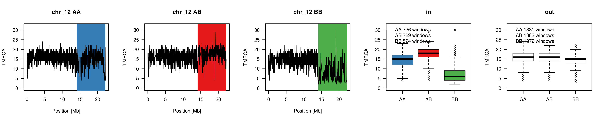


### Recombination rate (empirical)

Recombination rate was inferred by Karen Bascón-Cardozo using [`pyrho`](https://github.com/popgenmethods/pyrho).
Raw output of `Pyrho` are [`chr_12.AA.maf10_biall_W50_p20.rmap`](class-1/output/chr_12.AA.maf10_biall_W50_p20.rmap), [`chr_12.AB.maf10_biall_W50_p20.rmap`](class-1/output/chr_12.AB.maf10_biall_W50_p20.rmap), [`chr_12.BB.maf10_biall_W50_p20.rmap`](class-1/output/chr_12.BB.maf10_biall_W50_p20.rmap).

Calculate 10-kb mean recombination rate using [`PyrhoWindowMean.R`](class-1/scripts/PyrhoWindowMean.R).

```bash
chr=chr_12

for geno in AA AB BB
do
        echo $geno
        chrlen=`awk -v chr=$chr '$1==chr{print $2}' $dirlist/chromosomes_length.list`
        Rscript $dirscripts/PyrhoWindowMean.R --map $dirout/$chr.$geno.maf10_biall_W50_p20.rmap --winsize 10000 --winstep 10000 --chrlen $chrlen --chr $chr --output $dirout/$chr.inv.$geno
done

```

The mean recombination rates are found in [`class-1/output/`](class-1/output) named `chr_12.inv.<geno>_win.10kb_step.10kb.mean.rec.tab`.
Summarise the output in one file.
```bash
paste $dirout/chr_12.inv.AA_win.10kb_step.10kb.mean.rec.tab $dirout/chr_12.inv.AB_win.10kb_step.10kb.mean.rec.tab $dirout/chr_12.inv.BB_win.10kb_step.10kb.mean.rec.tab  | cut -f 1,2,3,4,5,6,12,18 | awk -v OFS="\t" '{if(NR==1){$6="AA";$7="AB";$8="BB"}print $0}' > $dirout/chr_12.rec.10kb.tab


```

Plot the results using [`plot_rec_class-1.R`](class-1/scripts/plot_rec_class-1.R)

```bash
Rscript $dirscripts/plot_rec_class-1.R --dirlist $dirlist --dirout $dirout

```

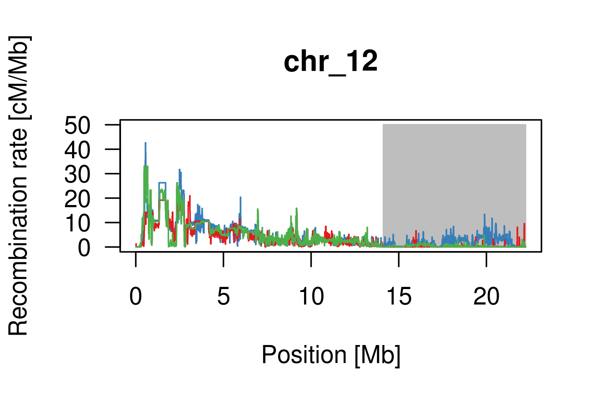


## Class-1 genomic islands (simulation)

### Coalescent time

Here I demonstrate how `MSMC2-decode`'s behaviour at a polymorphic inversion was assessed by simulating a polymorphic inversion using `SLiM`.

Note that subfolders in `slim/msmc2-decode/output/` were omitted because even for this small toy data, there were a lot of files.
Making directories and following the pipeline below should make similar output.


```bash
dirbase=$PWD/slim/msmc2-decode
dirscripts=$dirbase/scripts
dirlist=$dirbase/list
dirout=$dirbase/output
        dirlog=$dirout/log
        dirsum=$dirout/summary
        dirvcf=$dirout/vcf
        dirvcfind=$dirout/vcfind
        dirmultihetsep=$dirout/multihetsep
        dirdecode=$dirout/msmc-decode
        dirdecodesum=$dirout/msmc-decode_summary
dirfigures=$dirbase/figures

```

The list of parameters are written in [`slim/msmc2-decode/list/parameters.list`](slim/msmc2-decode/list/parameters.list)
The 9 lines correspond to the 9 models described in the paper.


Prepare SLiM scripts from [template](slim/msmc2-decode/scripts/template.slim).

```bash

while read f0 f1 s0 h0 s1 h1 s2 h2 FD model
do
        sed -e "s/f0/$f0/g;s/f1/$f1/g;s/s0/$s0/g;s/h0/$h0/g;s/s1/$s1/g;s/h1/$h1/g;s/s2/$s2/g;s/h2/$h2/g;s/model/$model/g;s@DIRBASE@$dirbase@g" $dirscripts/template.slim | awk -v FD=$FD 'NR<22||NR>26{print $0}NR>=22&&NR<=26{if(FD==0){print "//",$0}else{print $0}}' > $dirscripts/$model.slim
done<$dirlist/parameters.list

```

Now new `.slim` files were created in [`slim/msmc2-decode/scripts/`](slim/msmc2-decode/scripts/).


Make slurm commands to submit scripts and write them in [`slim/msmc2-decode/scripts/slim.commands.list`](slim/msmc2-decode/scripts/slim.commands.list).
In the paper I made 10,000 commands but here make 100.
Check [`slim/msmc2-decode/scripts/slim.sh`](slim/msmc2-decode/scripts/slim.sh) for detail.

```bash

for i in {0..99}
do
        id=`printf "%04d" $i`
        echo sbatch $dirscripts/slim.sh $dirbase $id
done > $dirscripts/slim.commands.list

```


Submit them. 
```bash
chmod +x $dirscripts/slim.commands.list
$dirscripts/slim.commands.list slim 200 100

```

Log files of SLiM are found in [`slim/msmc2-decode/output/log`](slim/msmc2-decode/output/log).
VCF files for (at maximum) 5 time points are found in [`slim/msmc2-decode/output/vcf`](slim/msmc2-decode/output/vcf).


Based on the log files, summarise how many generations inversion stayed in population for all simulations.
```bash

while read f0 f1 s0 h0 s1 h1 s2 h2 FD model
do
        for i in {0..99}
        do
                id=`printf "%04d" $i`
                tail -n1 $dirlog/${model}_$id.log | awk -v id=$id -v model=$model '{print model,id,$1-4000}'
        done 
done<$dirlist/parameters.list > $dirlog/model_id_lastgen.txt

```

Plot the distribution of generations when inversion is lost.
```bash
module load R/3.5.3
Rscript $dirscripts/plot_hist.R --dirbase $dirbase

```
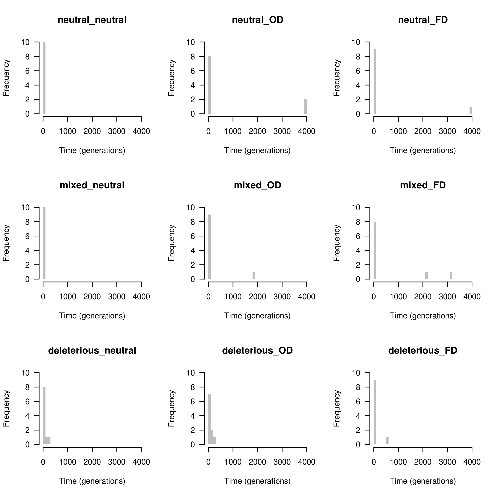


Make lists of id for which MSMC2-decode is performed.
Make 45 lists in total because of 9 models x 5 time points in [`slim/msmc2-decode/list/vcf_id`](slim/msmc2-decode/list/vcf_id).

```bash
mkdir $dirlist/vcf_id
cd $dirvcf
while read f0 f1 s0 h0 s1 h1 s2 h2 FD model
do
        for gen in 4100 4500 5000 6000 8000
        do
                ls ${model}_*_gen.$gen.vcf 2> /dev/null | awk -v FS="_" '{print $3}' > $dirlist/vcf_id/${model}_gen.${gen}.list  
        done
done<$dirlist/parameters.list 

cd $dirbase/../../

```


Check the distribution of genotype & allele frequencies for each time points of simulations for which `MSMC2-decode` is performed.

```bash

while read f0 f1 s0 h0 s1 h1 s2 h2 FD model
do
        for gen in 4100 4500 5000 6000 8000
        do
                while read id
                do
                        awk -v gen=$gen -v id=$id -v model=$model 'BEGIN{i=0}{if($1=="generation"){i=1}else if(i==1){if($1==gen){print model,$1,id,$2,$3,$4,2*$2+$3,2*$4+$3;kill}}}'  $dirlog/${model}_$id.log 
                done<$dirlist/vcf_id/${model}_gen.$gen.list
        done
done<$dirlist/parameters.list > $dirsum/model_gen_id_gf_af.txt

```

The first few lines of [`slim/msmc2-decode/output/summary/model_gen_id_gf_af.txt`](slim/msmc2-decode/output/summary/model_gen_id_gf_af.txt) are something like

```
neutral_neutral 4100 0072 999 1 0 1999 1
neutral_OD 4100 0000 897 100 3 1894 106
neutral_OD 4100 0015 779 214 7 1772 228
neutral_OD 4100 0023 816 173 11 1805 195

```

where the columns are, 1. model, 2. time including 4,000 burnin, 3. index/id of the simulation, 4. number of NN, 5. number of NI, 6. number of II, 7. number of N, 8. number of I.


Plot the distribution of genotype and allele frequencies for them.
```bash
module load R/3.5.3
Rscript $dirscripts/plot_gf_af.R --dirout $dirsum --dirfig $dirfigures

```


Prepare input for `MSMC2-decode`.

First bgzip and index all VCF files.

```bash

while read f0 f1 s0 h0 s1 h1 s2 h2 FD model
do
        for gen in 4100 4500 5000 6000 8000
        do
                sbatch $dirscripts/bcftools_bgzip_index.sh $model $gen $dirvcf $dirlist
        done
done<$dirlist/parameters.list 

```

Make list of IDs for individuals and their inversion genotypes.
```bash

mkdir $dirlist/genotype
while read f0 f1 s0 h0 s1 h1 s2 h2 FD model
do
        for gen in 4100 4500 5000 6000 8000
        do
                sbatch $dirscripts/genotype.sh $dirbase $model $gen
        done
done<$dirlist/parameters.list  

```


Select 4 samples for each genotype.
```bash

while read f0 f1 s0 h0 s1 h1 s2 h2 FD model
do
        for gen in 4100 4500 5000 6000 8000
        do
                sbatch $dirscripts/sample_4ind.sh $dirbase $model $gen
        done
done<$dirlist/parameters.list  

```


Make individual VCF for each of these samples.
```bash

while read f0 f1 s0 h0 s1 h1 s2 h2 FD model
do
        for gen in 4100 4500 5000 6000 8000
        do
                echo $model $gen
                sbatch $dirscripts/bcftools_ind.sh $dirbase $model $gen
        done
done<$dirlist/parameters.list  

```


Make negative mask file (specifying which parts to be used).
```bash
awk -v OFS="\t" 'BEGIN{print 1,0,5000000}' | bgzip > $dirlist/mask.bed.gz

```

Make multihetsep files.
```bash


while read f0 f1 s0 h0 s1 h1 s2 h2 FD model
do
        for gen in 4100 4500 5000 6000 8000
        do
                sbatch $dirscripts/run_generate_multihetsep.sh $dirbase $model $gen
        done
done<$dirlist/parameters.list

```


Make list of samples' 0-based indeces used in `MSMC2-decode`
```bash
while read f0 f1 s0 h0 s1 h1 s2 h2 FD model
do
        for gen in 4100 4500 5000 6000 8000
        do
                while read id
                do
                        for geno in NN NI II
                        do
                                awk 'BEGIN{c=0}{c++;print $1,2*c-2,2*c-1}' $dirlist/genotype/${model}_${id}_gen.$gen.$geno.4samples.list > $dirlist/genotype/${model}_${id}_gen.$gen.$geno.4samples.idx.list
                        done
                done<$dirlist/vcf_id/${model}_gen.$gen.list
        done
done<$dirlist/parameters.list

```


Prepare scritps for `MSMC2-decode`.
```bash
mu=4e-4
rec=4e-3

while read f0 f1 s0 h0 s1 h1 s2 h2 FD model
do
        for gen in 4100 4500 5000 6000 8000
        do
                while read id
                do
                        echo sbatch $dirscripts/decode.sh $dirbase $model $gen $id
                done<$dirlist/vcf_id/${model}_gen.$gen.list
        done
done<$dirlist/parameters.list > $dirscripts/decode.commands.list

```

Submit them. 
```bash
chmod +x $dirscripts/decode.commands.list
$dirscripts/decode.commands.list 

```


Summarise TMRCA for each genotype for each simulation.
```bash

while read f0 f1 s0 h0 s1 h1 s2 h2 FD model
do
        for gen in 4100 4500 5000 6000 8000
        do
                while read id
                do
                        echo sbatch $dirscripts/summarise_decode.1.sh $dirbase $model $gen $id 
                done<$dirlist/vcf_id/${model}_gen.$gen.list
        done
done<$dirlist/parameters.list  > $dirscripts/summarise_decode.1.commands.list

chmod +x $dirscripts/summarise_decode.1.commands.list
$dirscripts/summarise_decode.1.commands.list 


```


Calculate average descretised TMRCA within inversion and outside inversion for each genotype for each simulation.
```bash

while read f0 f1 s0 h0 s1 h1 s2 h2 FD model
do
        for gen in 4100 4500 5000 6000 8000
        do
                while read id
                do
                        for geno in NN NI II
                        do
                                if [[ ! -f $dirdecodesum/${model}_${id}_gen.$gen.$geno.decode-sum.txt ]];then
                                        touch $dirdecodesum/${model}_${id}_gen.$gen.$geno.decode-sum.txt
                                fi
                                awk 'BEGIN{nin=0;nout=0}$1>100000&&$1<=400000{nin++;sumin+=$2}$1<=100000||$1>400000{nout++;sumout+=$2}END{if(nin==0){meanin="NA"}else{meanin=sumin/nin};if(nout==0){meanout="NA"}else{meanout=sumout/nout};print meanin,meanout}' $dirdecodesum/${model}_${id}_gen.$gen.$geno.decode-sum.txt
                        done  | awk 'BEGIN{ORS=" "}{print $0}END{ORS="\n"}' | awk -v model=$model -v id=$id -v gen=$gen '{print model,id,gen,geno,$0}'
                done<$dirlist/vcf_id/${model}_gen.$gen.list
        done
done<$dirlist/parameters.list  >  $dirout/model_id_gen_tmrca.txt
awk 'BEGIN{print "model","id","gen","NNin","NNout","NIin","NIout","IIin","IIout"}{print $0}' $dirout/model_id_gen_tmrca.txt > $dirout/tmp ; mv $dirout/tmp $dirout/model_id_gen_tmrca.txt


```

Plot the results.
```bash
Rscript $dirscripts/plot_tmrca.R --dirout $dirout --dirfig $dirfigures

```

Inside inversion.
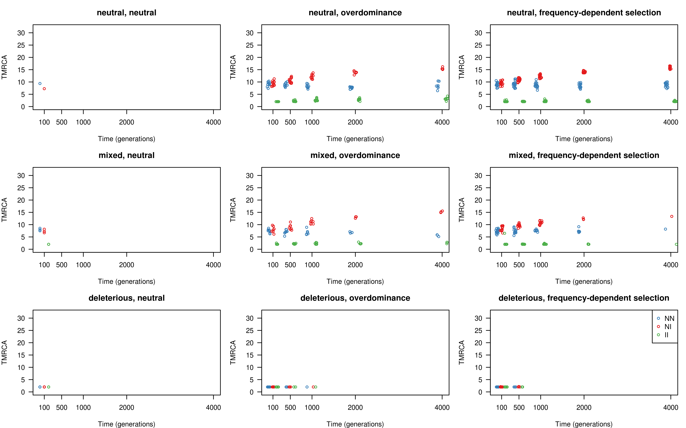


Outside inversion.
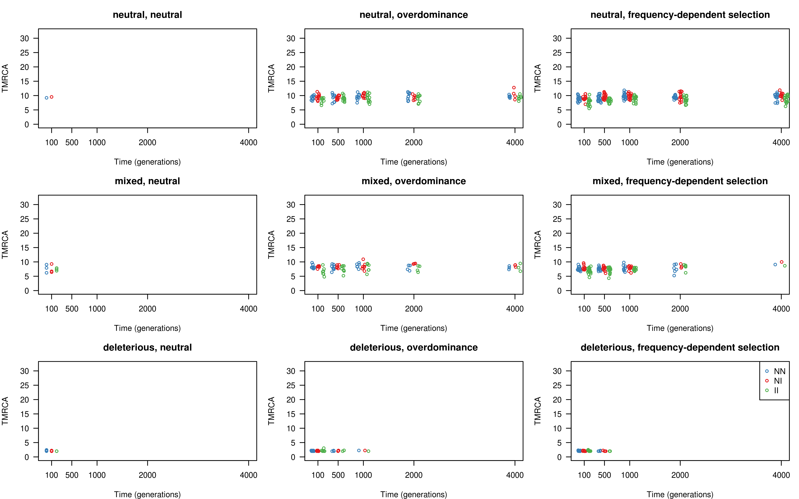


### Recombination rate

```bash
dirbase=$PWD/slim/pyrho
dirout=$dirbase/output
dirscripts=$dirbase/scripts

```


Here I demonstrate how `pyrho` behaves at a polymorphic inversion locus using samples with certain inversion genotype under different recombination suppression models (models 1-6 described in the paper).
Briefly, the 6 models are


chr1: 1 - 5,000,000 [bp]
chr2: 5,000,001 - 10,000,000 [bp]
Inversion: 1,000,001 - 4,000,000


+ Model 1
        + Inversion freq = 0.2
        + Recombination suppression: N-I

+ Model 2
        + Inversion freq = 0.2
        + Recombination suppression: N-I & I-I

+ Model 3
        + Inversion freq = 0.2
        + Recombination suppression: N-N & N-I & I-I

+ Model 4
        + Inversion freq = 0.8
        + Recombination suppression: N-I

+ Model 5
        + Inversion freq = 0.8
        + Recombination suppression: N-I & I-I

+ Model 6
        + Inversion freq = 0.8
        + Recombination suppression: N-N & N-I & I-I


The SLiM scripts are found in [`slim/pyrho/scripts/`](slim/pyrho/scripts/)

Keep submitting the scripts until you get a successful simulation for each model.
```bash
cd $dirscripts

for i in {1..6}
do
        j=1
        while [ $j -ge 1 ];
        do
                echo model$i
                slim model$i.slim > $dirout/model$i.log
                j=`grep lost $dirout/model$i.log | wc -l`
                echo j is $j
        done
done

cd $dirbase/../../

```

Bgzip and index the output VCF files.

```bash

for i in {1..6}
do
        bgzip $dirout/model$i.vcf
        bcftools index $dirout/model$i.vcf.gz
done

```


Split the VCF by (fake) chromosome.

```bash

for i in {1..6}
do
        bcftools view -t 1:1-5000000 $dirout/model$i.vcf.gz | bgzip > $dirout/model$i.chr1.vcf.gz
        bcftools index $dirout/model$i.chr1.vcf.gz
        bcftools view -t 1:5000001-10000000 $dirout/model$i.vcf.gz | bgzip > $dirout/model$i.chr2.vcf.gz
        bcftools index $dirout/model$i.chr2.vcf.gz
done

```


Make list of IDs and their inversion genotypes.
```bash
for i in {1..6}
do
        bcftools query -r 1:1000001  -f '[%GT ]' $dirout/model$i.vcf.gz | awk '{for(i=1;i<=NF;i++){print "i"i-1,$(i)}}' > $dirout/model$i.id.gt.list
        awk '$2=="0|0"{print $1}' $dirout/model$i.id.gt.list > $dirout/model$i.NN.list
        awk '$2=="0|1"||$2=="1|0"{print $1}' $dirout/model$i.id.gt.list > $dirout/model$i.NI.list
        awk '$2=="1|1"{print $1}' $dirout/model$i.id.gt.list > $dirout/model$i.II.list
done

```

Make list of random 10 samples for each genotype and then make VCF including them.
```bash
for i in {1..6}
do
        for geno in NN NI II
        do
                shuf $dirout/model$i.$geno.list | head -n 10 > $dirout/model$i.$geno.10samples.list
                bcftools view -S $dirout/model$i.$geno.10samples.list $dirout/model$i.chr1.vcf.gz | vcftools --vcf - --mac 1 --recode -c | bgzip > $dirout/model$i.$geno.chr1.vcf.gz
                bcftools index $dirout/model$i.$geno.chr1.vcf.gz
                bcftools view -S $dirout/model$i.$geno.10samples.list $dirout/model$i.chr2.vcf.gz | vcftools --vcf - --mac 1 --recode -c | bgzip > $dirout/model$i.$geno.chr2.vcf.gz
                bcftools index $dirout/model$i.$geno.chr2.vcf.gz
        done
done


```


Make lookup table and determine hyperparameters. 
It takes some time...
Precomputed results are `slim/pyrho/output/pyrho_lookup` and [`slim/pyrho/output/pyrho_hyperparam_results.txt`](slim/pyrho/output/pyrho_hyperparam_results.txt)

```bash

module load python/3.6.0

pyrho make_table --samplesize 20 --approx --moran_pop_size 25 --mu 4.6e-6 --outfile $dirout/pyrho_lookup --popsizes 1000,1000 --epochtimes 1000

pyrho hyperparam -n 20 --mu 4.6e-8 --blockpenalty 50,100 \
	--windowsize 25,50 --logfile . --tablefile $dirout/pyrho_lookup \
	--num_sims 10 \
	--popsizes 1000,1000 --epochtimes 1000 --outfile $dirout/pyrho_hyperparam_results.txt


```

Using `--blockpenalty` of 50 and `--windowsize` of 50, run `pyrho` to infer recombination rates for chromosomes 1 and 2 (with and without inversion) using certain genotypes.
```bash
module load python/3.6.0
for i in {1..6}
do
        for j in 1 2
        do
                for geno in NN NI II
                do
                        pyrho optimize --tablefile $dirout/pyrho_lookup \
                         --vcffile $dirout/model$i.$geno.chr$j.vcf.gz \
                         --outfile $dirout/model$i.$geno.chr$j.rmap \
                         --blockpenalty 50 --windowsize 50 \
                         --logfile .
                 done
        done
done

```

Edit the `pyrho` output to cM/Mb.
```bash

for i in {1..6}
do
        for j in 1 2
        do
                for geno in NN NI II
                do
                        awk -f $dirscripts/edit_map.awk $dirout/model$i.$geno.chr$j.rmap > $dirout/model$i.$geno.chr$j.rmap.cMMb.txt
                done
        done
done


```


Edit chr2, so that the position starts from 1.
```bash
for i in {1..6}
do
        for geno in NN NI II
        do
                awk '{print $1-5000000,$2,$3}' $dirout/model$i.$geno.chr2.rmap.cMMb.txt > $dirout/tmp
                mv $dirout/tmp $dirout/model$i.$geno.chr2.rmap.cMMb.txt
        done
done

```


Plot the results
```bash
module load R/3.5.3
Rscript $dirscripts/plot_slim_pyrho.R --dirout $dirout

```

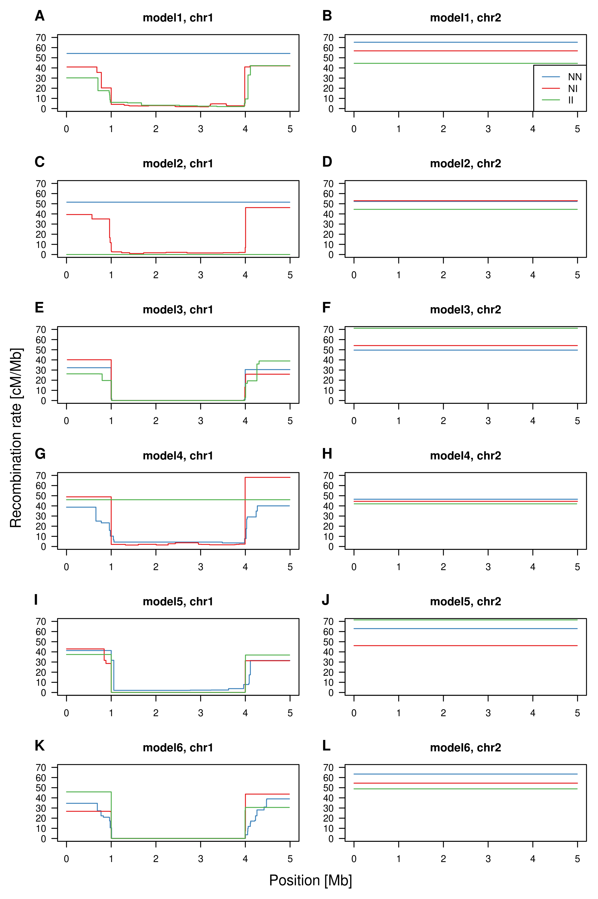


## Synteny analysis
### Synteny between blackcap and zebra finch

```bash
dirbase=$PWD/synteny
dirscripts=$dirbase/scripts
dirlist=$dirbase/list
dirin=$dirbase/input
dirout=$dirbase/output

```

VGP reference genome of zebra finch was obtained from <https://www.ncbi.nlm.nih.gov/assembly/GCF_008822105.2>.
This version of reference was chosen and downloaded by Karen Bascón-Cardozo.

VGP reference genome of blackcap was downloaded from <https://vgp.github.io/genomeark/Sylvia_atricapilla/> (`bSylAtr1.pri.cur.20190916.fasta.gz`).
We renamed the chromosomes as listed in `synteny/list/conversion_key_chr.csv`. 
This conversion was done by Andrea Bours.
We call this FASTA file with the converted chromosome notation "bSylAtr1.1.fa" (this file is not included in the repo due to its size).

`SatsumaSynteny` was run for homology-based synteny analysis between blackcap and zebra finch genomes.
This was done by Karen Bascón-Cardozo.
Precomputed file is [`satsuma_summary.chained.out`](satsuma_summary.chained.out). 


Format the output.

```bash
awk '$1~"chromosome"&&$1!~"scaffold"{gsub("^.*Blue55_chromosome_","",$1);gsub(",.*","",$1);print $1,$2,$3,$4,$5,$6}' $dirout/satsuma_summary.chained.out  > $dirout/zebrafinch_blackcap_satsuma.txt

```

Coordinates of all local PCA outlier regions were copied to [`synteny/list/local_PCA_MDS_outlier.bed`](synteny/list/local_PCA_MDS_outlier.bed).
Coordinates of 5 class-1 genomic islands were copied to [`synteny/list/local_PCA_MDS_class-1.bed`](synteny/list/local_PCA_MDS_class-1.bed).
Make circos plots.


```bash
module load R/3.5.3
Rscript $dirscripts/plot_synteny_BC_sp.R --chrlen $dirlist/ZF_VGP_chromosomes_length.list --satsuma $dirout/zebrafinch_blackcap_satsuma.txt --sppname "zebra finch" --dirout $dirout --dirlist $dirlist

```
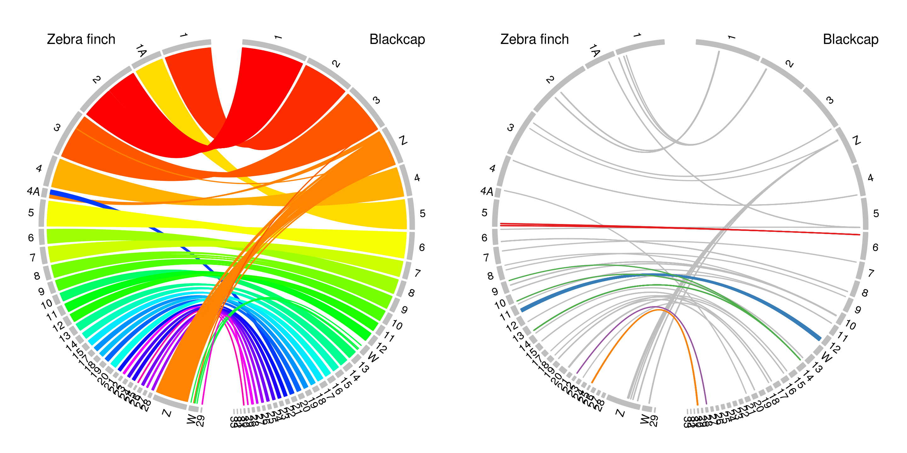


## ML phylogeny 

Reference genome of zebra finch (taeGut1, WUSTL v3.2.4) was downloaded (not included in this repo due to its size).
```bash
rsync -avzP  rsync://hgdownload.cse.ucsc.edu/goldenPath/taeGut1/bigZips/taeGut1.fa.gz 
zcat taeGut1.fa.gz > $dirin/Tgu.fa

```


