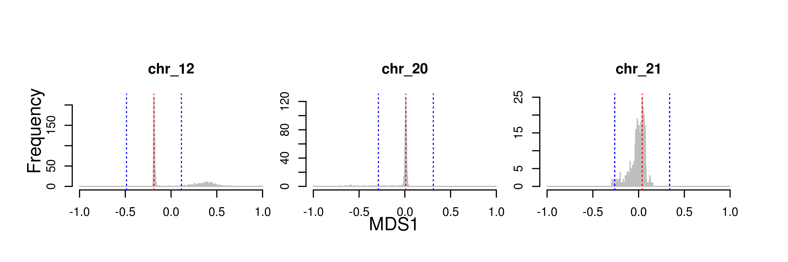
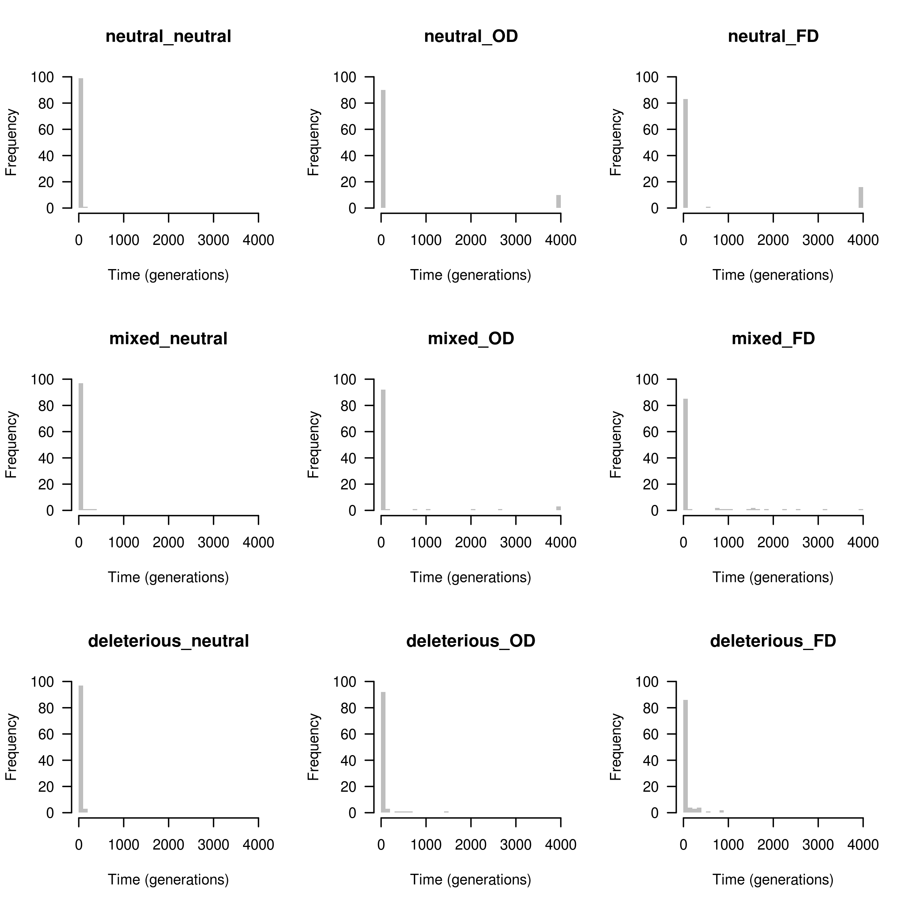
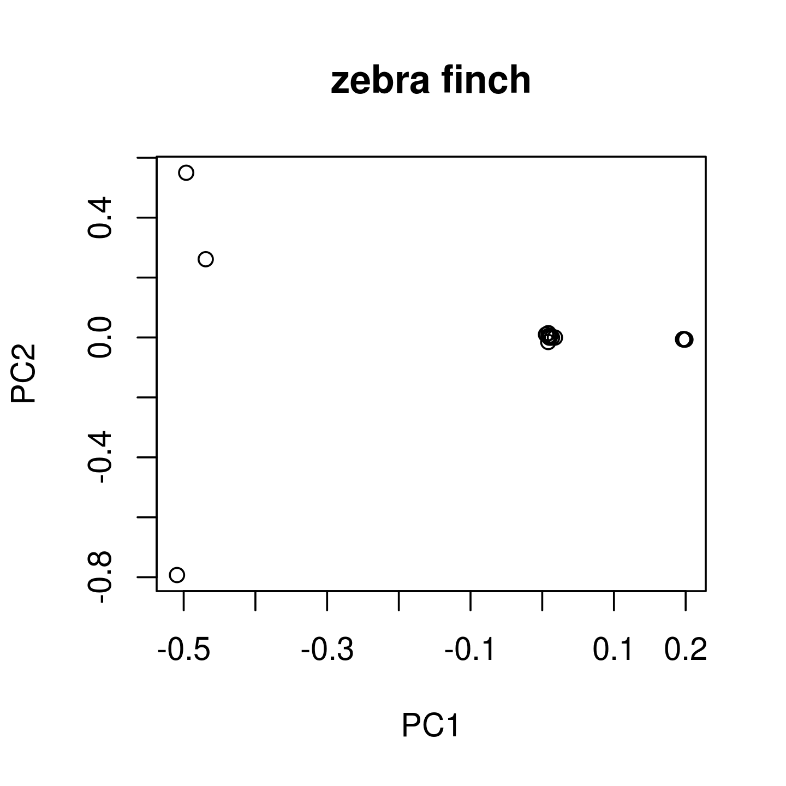
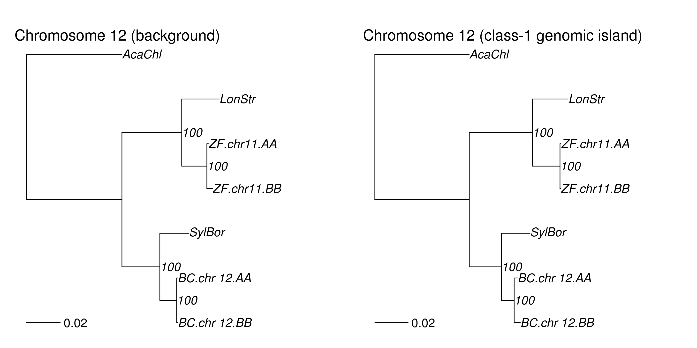
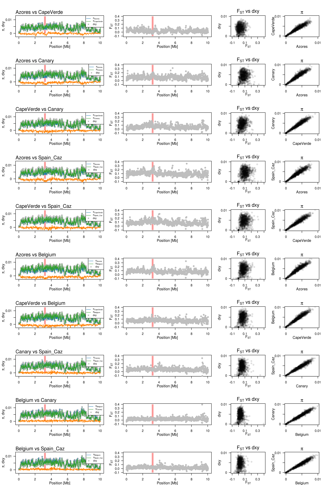
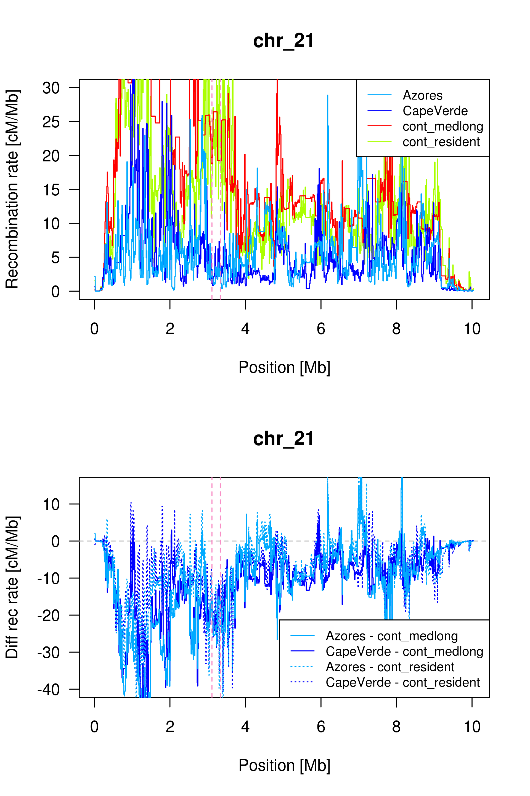
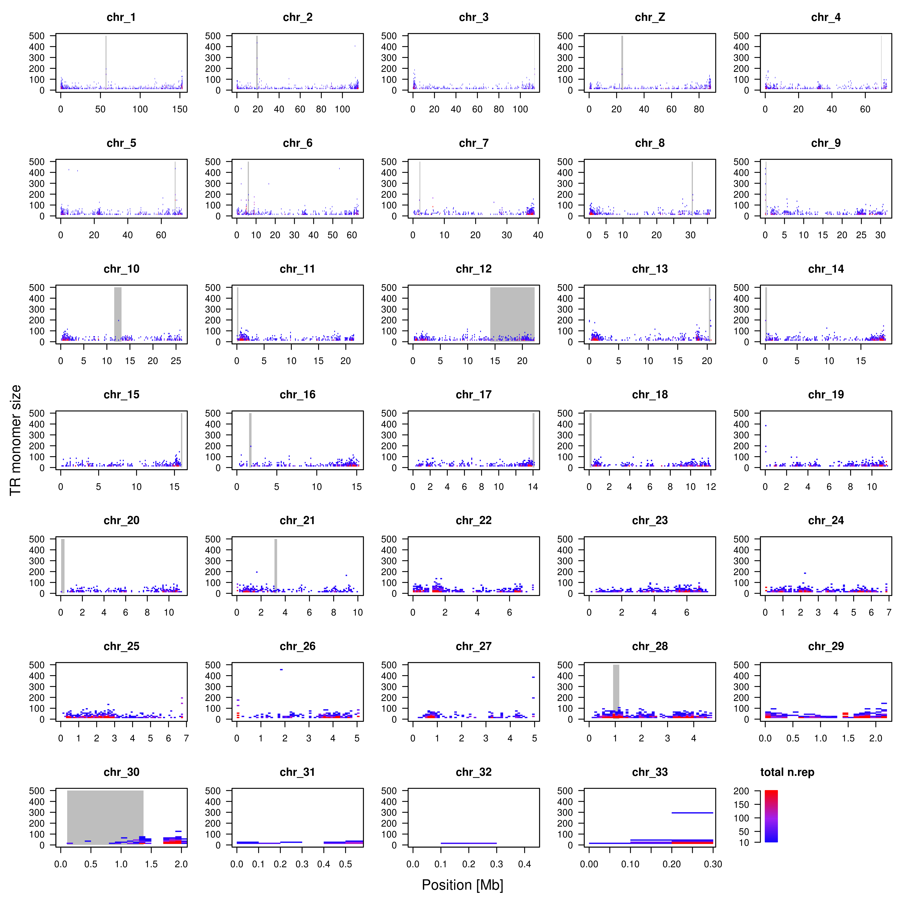
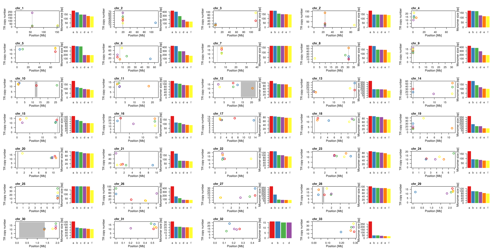

# Pipeline for "Recombination suppression and selection affect local ancestries in genomes of a migratory songbird"


Jun Ishigohoka


Here I describe the key analyses done in our study, [Ishigohoka et al. 2021](https://www.biorxiv.org/content/10.1101/2021.12.22.473882v1.full).

Generally used software  
+ [`BCFtools`](http://www.htslib.org/doc/1.0/bcftools.html)
+ [`tabix`](http://www.htslib.org/doc/tabix.html)
+ [`VCFtools`](https://vcftools.github.io/)


## Local PCA

Here I show how local PCA was run with three example chromosomes, 12, 20, and 21, which are listed in `local_PCA/list/chromosomes/list`

Key software used
+ [`lostruct`](https://github.com/petrelharp/local_pca)

```bash
dirbase=$PWD/local_PCA
dirin=$dirbase/input
dirvcf=$dirin/vcf
dirtab=$dirin/table
dirlist=$dirbase/list
dirout=$dirbase/output
dirlocalpca=$dirout/local_PCA
dirlocalpcamds=$dirout/local_PCA_MDS
dirscripts=$dirbase/scripts

```

Download filtered VCF files for chromosomes 12, 20, 21.

```bash
cd $dirvcf
wget -O vcfs.tar.gz "https://ftp.evolbio.mpg.de/main.html?download&weblink=6e1a525bfb81af987e4ddde20c466d23&realfilename=vcfs.tar.gz"
tar xvzf vcfs.tar.gz
cd $dirbase/../

```


Make list of sites from VCF.
```bash
while read chr
do
        bcftools query -f '%POS\n' $dirvcf/$chr.vcf.gz > $dirtab/$chr.sites.list
done <$dirlist/chromosomes.list

```

Make genotype table from VCF.
```bash

while read chr
do
        sbatch $dirscripts/vcf2table.sh $dirvcf/$chr.vcf.gz $dirtab/$chr.table
done <$dirlist/chromosomes.list


```


Run local PCA.
[`local_PCA/scripts/local_PCA.sh`](local_PCA/scripts/local_PCA.sh) submits [`local_PCA/scripts/local_PCA.R`](local_PCA/scripts/local_PCA.R) via slurm.
Check [`local_PCA/scripts/local_PCA.sh`](local_PCA/scripts/local_PCA.sh) and [`local_PCA/scripts/local_PCA.R`](local_PCA/scripts/local_PCA.R) for detail.

```bash
module load R/3.5.3

while read chr 
do
        sbatch $dirscripts/local_PCA.sh $dirtab $dirtab $dirlocalpca $dirlocalpcamds $dirlist $chr $dirscripts
done <$dirlist/chromosomes.list


```


Concatenate the output for the three chromosomes.
```bash

while read chr
do
        cat $dirlocalpcamds/local_PCA_MDS_$chr.txt
done <$dirlist/chromosomes.list | awk 'NR==1{print $0}NR>1{if($1!="chr")print $0}' > $dirlocalpcamds/local_PCA_MDS_3_chromosomes.txt


```


Get threshold of MDS values and plot MDS distribution.
```bash

Rscript $dirscripts/plot_local_PCA_MDS_distribution.R --input $dirlocalpcamds/local_PCA_MDS_3_chromosomes.txt --output $dirlocalpcamds/local_PCA_MDS_3_chromosomes --chrlist $dirlist/chromosomes.list

```



Plot MDS1 vs MDS2.

```bash

Rscript $dirscripts/plot_local_PCA_MDS_MDS1-vs-MDS2.R --input $dirlocalpcamds/local_PCA_MDS_3_chromosomes.txt --thre $dirlocalpcamds/local_PCA_MDS_3_chromosomesthreshold.txt --output $dirlocalpcamds/local_PCA_MDS --chrlist $dirlist/chromosomes.list

```


Get coordinates of outlier windows.
```bash
Rscript $dirscripts/getOutliers.R --input $dirlocalpcamds/local_PCA_MDS_3_chromosomes.txt --thre $dirlocalpcamds/local_PCA_MDS_3_chromosomesthreshold.txt --output $dirlocalpcamds/local_PCA_MDS --chrlist $dirlist/chromosomes.list

```

Make Manhattan plots.
```bash
Rscript $dirscripts/plot_local_PCA_MDS_manhattan.R --input $dirlocalpcamds/local_PCA_MDS_3_chromosomes.txt --thre $dirlocalpcamds/local_PCA_MDS_3_chromosomesthreshold.txt --bed $dirlocalpcamds/local_PCA_MDS_outlier.bed --output $dirlocalpcamds/local_PCA_MDS --chrlist $dirlist/chromosomes_length.list

```


## PCA in local PCA outliers


Here I show how PCA was run for three local PCA outlier regions of chromosomes 12, 20, and 21, which represent class-1, 2, and 3 outliers.


Key software used  
+ [`PLINK` v.1.9](https://www.cog-genomics.org/plink/)


```bash
dirbase=$PWD/PCA
dirin=$dirbase/input
dirvcf=$dirin/vcf
dirlist=$dirbase/list
dirout=$dirbase/output
dirscripts=$dirbase/scripts

```

Link VCF files from `local_PCA/input/vcf` and index them.

```bash
ln $dirbase/../local_PCA/input/vcf/*vcf.gz $dirvcf

while read chr
do
        echo $chr
        bcftools index $dirvcf/$chr.vcf.gz
done<$dirlist/chromosomes.list


```

Copy BED file for coordinates of local PCA outliers of chromosomes 12, 20, and 21.

```bash
ln $dirbase/../local_PCA/output/local_PCA_MDS/local_PCA_MDS_outlier.bed $dirlist

```

Extract SNPs within the local PCA outlier regions.

```bash

while read chr from to
do
        bcftools view -O z -r $chr:$from-$to -S $dirlist/blackcap_id.list $dirvcf/$chr.vcf.gz | vcftools --gzvcf - --max-missing 0.9 --recode --recode-INFO-all -c |bgzip > $dirvcf/${chr}_${from}_$to.vcf.gz
done < $dirlist/local_PCA_MDS_outlier.bed

```

Run `PLINK` for PCA.
```bash

while read chr from to
do
        sbatch $dirscripts/plink_pca.sh  $dirvcf/${chr}_${from}_$to $dirout/${chr}_${from}_$to
done < $dirlist/local_PCA_MDS_outlier.bed

```


Plot PCA results.
```bash

Rscript $dirscripts/plot_pca_per_outlier.R --dirpca $dirout --poplist $dirlist/id_spp_pop_site_pheno.tsv --outlierlist $dirlist/local_PCA_MDS_outlier.bed --chrlist $dirlist/chromosomes.list

```


Get Eigenvalues.

```bash

while read chr pos1 pos2
do
        awk -v chr=$chr -v pos1=$pos1 -v pos2=$pos2 'BEGIN{printf "%s %s %s ", chr,pos1,pos2}{printf "%s ",$1}END{print ""}' $dirout/${chr}_${pos1}_${pos2}.eigenval
done < $dirlist/local_PCA_MDS_outlier.bed | awk 'NR==1{printf "%s %s %s ","chr","pos1","pos2";for(i=4;i<=NF;i++){printf "%s ","PC"i-3};print ""}{print $0}'> $dirout/eigenvalues.txt


```

Plot Eigenvalues.

```bash

Rscript $dirscripts/plot_eigenval.R --dirpca $dirout 

```


## Population genetics of class-1 genomic islands (empirical)

Here I demonstrate how population genomic analyses were performed on class-1 genomic islands, using chromosome 12 as an example.

Key software used   
+ [`PopGenome`](https://popgenome.weebly.com/) package of R.
+ [`generate_multihetsep.py`](https://github.com/stschiff/msmc-tools) from `MSMC-tools`.
+ [`decode`](https://github.com/stschiff/msmc2) compiled with `MSMC2`. Expalined in <https://github.com/stschiff/msmc/blob/master/guide.md#estimating-the-local-tmrca-states>.
+ [`pyrho`](https://github.com/popgenmethods/pyrho)


```bash

dirbase=$PWD/class-1_popgen
dirin=$dirbase/input
dirvcf=$dirin/vcf
dirmask=$dirin/mask
dirmultihetsep=$dirin/multihetsep
dirlist=$dirbase/list
dirout=$dirbase/output
dirscripts=$dirbase/scripts

```

### Heterozygosity


Make link to VCF of chromosome 12, as an example chromosome harbouring a class-1 genomic island.
```bash
ln $dirbase/../PCA/input/vcf/chr_12.vcf.gz  $dirvcf
ln $dirbase/../PCA/input/vcf/chr_12.vcf.gz.csi  $dirvcf

```

Get coordinates of class-1 genomic island of chromosome 12.

```bash

awk -v OFS="\t" '$1=="chr_12"{$1=$1;print $0}' $dirbase/../local_PCA/output/local_PCA_MDS/local_PCA_MDS_outlier.bed > $dirlist/class-1.chr_12.bed

```

Make list of individuals with AA, AB, and BB. 

```bash

awk '$3<0{print $1}' $dirbase/../PCA/output/chr_12_14126710_22227355.eigenvec > $dirlist/chr_12.AA.list
awk '$3>0.15{print $1}' $dirbase/../PCA/output/chr_12_14126710_22227355.eigenvec > $dirlist/chr_12.BB.list
awk '$3>0&&$3<0.15{print $1}' $dirbase/../PCA/output/chr_12_14126710_22227355.eigenvec > $dirlist/chr_12.AB.list

```


Compute heterozygosity.
```bash

while read chr pos1 pos2
do
        for geno in AA AB BB
        do
                while read id
                do
                        # echo $id $chr $geno
                        bcftools query -f '[%GT ]\n' -r $chr:$pos1-$pos2 -s $id $dirvcf/$chr.vcf.gz |sed 's@0/0@0@g;s@0|0@0@g;s@1/1@0@g;s@1|1@0@g;s@0/1@1@g;s@0|1@1@g;s@1|0@1@g;s@\./\.@@g;s@\.|\.@@g' | awk -v chr=$chr -v geno=$geno -v id=$id '{i++;s+=$1}END{print chr,geno,id,s,i,s/i}'
                done<$dirlist/${chr}.$geno.list
        done 
done < $dirlist/class-1.chr_12.bed | awk 'BEGIN{print "chr","geno","id","n.het","n.sites","het"}{print $0}' > $dirout/chr_12.het.txt


```

Plot heterozygosity for AA, AB, and BB.

```bash

Rscript $dirscripts/plot_het.R --dir $dirout

```


### F<sub>ST</sub>, d<sub>XY</sub> and π

Copy `chromosomes_length.list`.

```bash
cp $dirbase/../local_PCA/list/chromosomes_length.list $dirlist

```


Make [`chr_12_IDgeno.list`](class-1_popgen/list/chr_12_IDgeno.list).

```bash

while read chr pos1 pos2
do
        for geno in AA BB
        do
                awk -v geno=${chr}.${geno} '{print $1,geno}' $dirlist/${chr}.$geno.list 
        done |awk 'BEGIN{print "sample","population"}{print $0}' > $dirlist/${chr}_IDgeno.list
done<$dirlist/class-1.chr_12.bed

```

Tabix input VCF.
```bash
tabix $dirvcf/chr_12.vcf.gz

```


Run PopGenome.
[`class-1_popgen/scripts/PopGenome_windowstats.sh`](class-1_popgen/scripts/PopGenome_windowstats.sh) submits [`class-1_popgen/scripts/PopGenome_windowstats.R`](class-1_popgen/scripts/PopGenome_windowstats.R via slurm).
Check [`class-1_popgen/scripts/PopGenome_windowstats.sh`](class-1_popgen/scripts/PopGenome_windowstats.sh) and [`class-1_popgen/scripts/PopGenome_windowstats.R`](class-1_popgen/scripts/PopGenome_windowstats.R) for detail.

```bash

win=10000
while read chr pos1 pos2
do
sbatch $dirscripts/PopGenome_windowstats.sh \
$dirvcf/$chr.vcf.gz \
$dirlist/chromosomes_length.list \
$chr \
$dirlist/${chr}_IDgeno.list \
$win \
$dirout/blackcap.$chr.AA.BB
done<$dirlist/class-1.chr_12.bed


```


Plot the results.
```bash
module load R/3.5.3
Rscript $dirscripts/plot_windowstats_class-1.R --dir $dirout --bedfile $dirlist/class-1.chr_12.bed

```


Run permutation tests.

```bash

while read chr pos1 pos2
do
        if [ $chr != "chr_6" ];then
                Rscript $dirscripts/permutation_windowstats.R --chr $chr --pos1 $pos1 --pos2 $pos2 --n 10000 --pifile $dirout/blackcap.$chr.AA.BB_pi_PopGenome10kb.txt --dxyfile $dirout/blackcap.$chr.AA.BB_dxy_PopGenome10kb.txt --fstfile $dirout/blackcap.$chr.AA.BB_FST_PopGenome10kb.txt
        fi
done<$dirlist/class-1.chr_12.bed | awk 'BEGIN{print "chr","pos.from","pos.to","p.val_piAA","p.val_pi.BB","p.val_dxy","p.val_FST","p.val_pi1-pi2"}{print $0}' | sed 's/ /,/g' > $dirout/permutation_windowstats_class1.csv

```

The result is written in [`class-1_popgen/output/permutation_windowstats_class1.csv`](class-1_popgen/output/permutation_windowstats_class1.csv).


### Coalescent time (empirical)

Samples used for coalescent time analysis are listed in [`class-1_popgen/list/chr_12.AA.4samples.list`](class-1_popgen/list/chr_12.AA.4samples.list), [`class-1_popgen/list/chr_12.AB.4samples.list`](class-1_popgen/list/chr_12.AB.4samples.list) and [`class-1_popgen/list/chr_12.BB.4samples.list`](class-1_popgen/list/chr_12.BB.4samples.list).


Mask files were created using `generate_multihetsep.py` following <https://github.com/stschiff/msmc-tools> from alignment files (BAM) and reference file (FASTA).
Precomputed mask files are found in [`class-1_popgen/input/mask/`](class-1_popgen/input/mask/).


Split VCF file into individuals.

```bash

for geno in AA AB BB
do
        while read id
        do
                echo $geno $id
                bcftools view -s $id -M2 -m2 $dirvcf/chr_12.vcf.gz | vcftools --vcf - --mac 1 --recode -c | bgzip > $dirvcf/$id.chr_12.vcf.gz
        done < $dirlist/chr_12.$geno.4samples.list 
done

```


Make `run_generate_multihetsep_chr_12.<genotype>.sh` files in [`class-1_popgen/scripts/run_generate_multihetsep/`](class-1_popgen/scripts/run_generate_multihetsep/).

```bash
$dirscripts/write_run_generate_multihetsep_per_group.sh $dirbase

```


Submit them via slurm to make [multihetsep files](class-1_popgen/input/multihetsep/).

```bash

for geno in AA AB BB
do
        sbatch $dirscripts/run_generate_multihetsep/run_generate_multihetsep_chr_12.$geno.sh $dirmask $dirvcf $dirmultihetsep
done

```


Get 0-based index of samples for `MSMC2-decode`.

```bash
for geno in AA AB BB
do
        awk 'BEGIN{c=0}{c++;print $1,2*c-2,2*c-1}' $dirlist/chr_12.$geno.4samples.list > $dirlist/chr_12.$geno.4samples.idx.list
done

```


Based on recommendation of [`MSMC2-decode`](https://github.com/stschiff/msmc/blob/master/guide.md#estimating-the-local-tmrca-states), mutation rate is defined as a half of heterozygosity (Watterson's theta) for mutation rate and 80% of it for recombination rate.
Watterson's theta was computed using chromosome 20, and was 0.00454362.

```bash
mu=`awk -v m=0.00454362 'BEGIN{print m/2}'`
rec=`awk -v mu=$mu 'BEGIN{print 0.8*mu}'`

for geno in AA AB BB
do
        while read id idx1 idx2
        do
                decode -m $mu -r $rec -I $idx1,$idx2 -t 32 -s 10000 $dirmultihetsep/chr_12.$geno.multihetsep.txt > $dirout/chr_12.$geno.$id.posterior.txt
        done < $dirlist/chr_12.$geno.4samples.idx.list
done

```

Summarise the discretised times with the highest posterior for each genomic segment.
```bash

for geno in AA AB BB
do
        while read id idx1 idx2
        do
                awk '{p=0;k=0;for(i=2;i<=NF;i++){if($i>p){p=$i;k=i}};print $1,k}' $dirout/chr_12.$geno.$id.posterior.txt > $dirout/chr_12.$geno.$id.tmrca.txt
        done < $dirlist/chr_12.$geno.4samples.idx.list
done

```

```bash
module load R/3.5.3
Rscript $dirscripts/plot_tmrca.R --dirlist $dirlist --dirout $dirout

```


### Recombination rate (empirical)

Recombination rate was inferred by Karen Bascón-Cardozo using [`pyrho`](https://github.com/popgenmethods/pyrho).
Raw output of `Pyrho` are [`chr_12.AA.maf10_biall_W50_p20.rmap`](class-1_popgen/output/chr_12.AA.maf10_biall_W50_p20.rmap), [`chr_12.AB.maf10_biall_W50_p20.rmap`](class-1_popgen/output/chr_12.AB.maf10_biall_W50_p20.rmap), [`chr_12.BB.maf10_biall_W50_p20.rmap`](class-1_popgen/output/chr_12.BB.maf10_biall_W50_p20.rmap).

Calculate 10-kb mean recombination rate using [`PyrhoWindowMean.R`](class-1_popgen/scripts/PyrhoWindowMean.R).

```bash
chr=chr_12

for geno in AA AB BB
do
        echo $geno
        chrlen=`awk -v chr=$chr '$1==chr{print $2}' $dirlist/chromosomes_length.list`
        Rscript $dirscripts/PyrhoWindowMean.R --map $dirout/$chr.$geno.maf10_biall_W50_p20.rmap --winsize 10000 --winstep 10000 --chrlen $chrlen --chr $chr --output $dirout/$chr.inv.$geno
done

```

The mean recombination rates are found in [`class-1_popgen/output/`](class-1_popgen/output) named `chr_12.inv.<geno>_win.10kb_step.10kb.mean.rec.tab`.
Summarise the output in one file.
```bash
paste $dirout/chr_12.inv.AA_win.10kb_step.10kb.mean.rec.tab $dirout/chr_12.inv.AB_win.10kb_step.10kb.mean.rec.tab $dirout/chr_12.inv.BB_win.10kb_step.10kb.mean.rec.tab  | cut -f 1,2,3,4,5,6,12,18 | awk -v OFS="\t" '{if(NR==1){$6="AA";$7="AB";$8="BB"}print $0}' > $dirout/chr_12.rec.10kb.tab


```

Plot the results using [`plot_rec_class-1.R`](class-1_popgen/scripts/plot_rec_class-1.R)

```bash
Rscript $dirscripts/plot_rec_class-1.R --dirlist $dirlist --dirout $dirout

```


## Class-1 genomic islands (simulation)

Here I demonstrate how simulations were performed to investigate the performance of `MSMC2-decode` and `pyrho` at a polymorphic inversion.


Key software used  
+ [`SLiM` v.3.5](https://messerlab.org/slim/)
+ [`pyrho`](https://github.com/popgenmethods/pyrho)
+ [`decode`](https://github.com/stschiff/msmc2) compiled with `MSMC2`. Expalined in <https://github.com/stschiff/msmc/blob/master/guide.md#estimating-the-local-tmrca-states>.


### Coalescent time

Here I demonstrate how `MSMC2-decode`'s behaviour at a polymorphic inversion was assessed by simulating a polymorphic inversion using `SLiM`.

Note that subfolders in `slim/msmc2-decode/output/` were omitted because even for this small toy data, there were a lot of files.
Making directories and following the pipeline below should make similar output.


```bash
dirbase=$PWD/slim/msmc2-decode
dirscripts=$dirbase/scripts
dirlist=$dirbase/list
dirout=$dirbase/output
        dirlog=$dirout/log
        dirsum=$dirout/summary
        dirvcf=$dirout/vcf
        dirvcfind=$dirout/vcfind
        dirmultihetsep=$dirout/multihetsep
        dirdecode=$dirout/msmc-decode
        dirdecodesum=$dirout/msmc-decode_summary
dirfigures=$dirbase/figures

```

The list of parameters are written in [`slim/msmc2-decode/list/parameters.list`](slim/msmc2-decode/list/parameters.list)
The 9 lines correspond to the 9 models described in the paper.


Prepare SLiM scripts from [template](slim/msmc2-decode/scripts/template.slim).

```bash

while read f0 f1 s0 h0 s1 h1 s2 h2 FD model
do
        sed -e "s/f0/$f0/g;s/f1/$f1/g;s/s0/$s0/g;s/h0/$h0/g;s/s1/$s1/g;s/h1/$h1/g;s/s2/$s2/g;s/h2/$h2/g;s/model/$model/g;s@DIRBASE@$dirbase@g" $dirscripts/template.slim | awk -v FD=$FD 'NR<22||NR>26{print $0}NR>=22&&NR<=26{if(FD==0){print "//",$0}else{print $0}}' > $dirscripts/$model.slim
done<$dirlist/parameters.list

```

Now new `.slim` files were created in [`slim/msmc2-decode/scripts/`](slim/msmc2-decode/scripts/).


Make slurm commands to submit scripts and write them in [`slim/msmc2-decode/scripts/slim.commands.list`](slim/msmc2-decode/scripts/slim.commands.list).
In the paper I made 10,000 commands but here make 100.
Check [`slim/msmc2-decode/scripts/slim.sh`](slim/msmc2-decode/scripts/slim.sh) for detail.

```bash

for i in {0..99}
do
        id=`printf "%04d" $i`
        echo sbatch $dirscripts/slim.sh $dirbase $id
done > $dirscripts/slim.commands.list

```


Submit them. 
```bash
chmod +x $dirscripts/slim.commands.list
$dirscripts/slim.commands.list slim 200 100

```

Log files of SLiM are found in [`slim/msmc2-decode/output/log`](slim/msmc2-decode/output/log).
VCF files for (at maximum) 5 time points are found in [`slim/msmc2-decode/output/vcf`](slim/msmc2-decode/output/vcf).


Based on the log files, summarise how many generations inversion stayed in population for all simulations.
```bash

while read f0 f1 s0 h0 s1 h1 s2 h2 FD model
do
        for i in {0..99}
        do
                id=`printf "%04d" $i`
                tail -n1 $dirlog/${model}_$id.log | awk -v id=$id -v model=$model '{print model,id,$1-4000}'
        done 
done<$dirlist/parameters.list > $dirlog/model_id_lastgen.txt

```

Plot the distribution of generations when inversion is lost.
```bash
module load R/3.5.3
Rscript $dirscripts/plot_hist.R --dirbase $dirbase

```



Make lists of id for which MSMC2-decode is performed.
Make 45 lists in total because of 9 models x 5 time points in [`slim/msmc2-decode/list/vcf_id`](slim/msmc2-decode/list/vcf_id).

```bash
mkdir $dirlist/vcf_id
cd $dirvcf
while read f0 f1 s0 h0 s1 h1 s2 h2 FD model
do
        for gen in 4100 4500 5000 6000 8000
        do
                ls ${model}_*_gen.$gen.vcf 2> /dev/null | awk -v FS="_" '{print $3}' > $dirlist/vcf_id/${model}_gen.${gen}.list  
        done
done<$dirlist/parameters.list 

cd $dirbase/../../

```


Check the distribution of genotype & allele frequencies for each time points of simulations for which `MSMC2-decode` is performed.

```bash

while read f0 f1 s0 h0 s1 h1 s2 h2 FD model
do
        for gen in 4100 4500 5000 6000 8000
        do
                while read id
                do
                        awk -v gen=$gen -v id=$id -v model=$model 'BEGIN{i=0}{if($1=="generation"){i=1}else if(i==1){if($1==gen){print model,$1,id,$2,$3,$4,2*$2+$3,2*$4+$3;kill}}}'  $dirlog/${model}_$id.log 
                done<$dirlist/vcf_id/${model}_gen.$gen.list
        done
done<$dirlist/parameters.list > $dirsum/model_gen_id_gf_af.txt

```

The first few lines of [`slim/msmc2-decode/output/summary/model_gen_id_gf_af.txt`](slim/msmc2-decode/output/summary/model_gen_id_gf_af.txt) are something like

```
neutral_neutral 4100 0072 999 1 0 1999 1
neutral_OD 4100 0000 897 100 3 1894 106
neutral_OD 4100 0015 779 214 7 1772 228
neutral_OD 4100 0023 816 173 11 1805 195

```

where the columns are, 1. model, 2. time including 4,000 burnin, 3. index/id of the simulation, 4. number of NN, 5. number of NI, 6. number of II, 7. number of N, 8. number of I.


Plot the distribution of genotype and allele frequencies for them.
```bash
module load R/3.5.3
Rscript $dirscripts/plot_gf_af.R --dirout $dirsum --dirfig $dirfigures

```


Prepare input for `MSMC2-decode`.

First bgzip and index all VCF files.

```bash

while read f0 f1 s0 h0 s1 h1 s2 h2 FD model
do
        for gen in 4100 4500 5000 6000 8000
        do
                sbatch $dirscripts/bcftools_bgzip_index.sh $model $gen $dirvcf $dirlist
        done
done<$dirlist/parameters.list 

```

Make list of IDs for individuals and their inversion genotypes.
```bash

mkdir $dirlist/genotype
while read f0 f1 s0 h0 s1 h1 s2 h2 FD model
do
        for gen in 4100 4500 5000 6000 8000
        do
                sbatch $dirscripts/genotype.sh $dirbase $model $gen
        done
done<$dirlist/parameters.list  

```


Select 4 samples for each genotype.
```bash

while read f0 f1 s0 h0 s1 h1 s2 h2 FD model
do
        for gen in 4100 4500 5000 6000 8000
        do
                sbatch $dirscripts/sample_4ind.sh $dirbase $model $gen
        done
done<$dirlist/parameters.list  

```


Make individual VCF for each of these samples.
```bash

while read f0 f1 s0 h0 s1 h1 s2 h2 FD model
do
        for gen in 4100 4500 5000 6000 8000
        do
                echo $model $gen
                sbatch $dirscripts/bcftools_ind.sh $dirbase $model $gen
        done
done<$dirlist/parameters.list  

```


Make negative mask file (specifying which parts to be used).
```bash
awk -v OFS="\t" 'BEGIN{print 1,0,5000000}' | bgzip > $dirlist/mask.bed.gz

```

Make multihetsep files.
```bash


while read f0 f1 s0 h0 s1 h1 s2 h2 FD model
do
        for gen in 4100 4500 5000 6000 8000
        do
                sbatch $dirscripts/run_generate_multihetsep.sh $dirbase $model $gen
        done
done<$dirlist/parameters.list

```


Make list of samples' 0-based indeces used in `MSMC2-decode`
```bash
while read f0 f1 s0 h0 s1 h1 s2 h2 FD model
do
        for gen in 4100 4500 5000 6000 8000
        do
                while read id
                do
                        for geno in NN NI II
                        do
                                awk 'BEGIN{c=0}{c++;print $1,2*c-2,2*c-1}' $dirlist/genotype/${model}_${id}_gen.$gen.$geno.4samples.list > $dirlist/genotype/${model}_${id}_gen.$gen.$geno.4samples.idx.list
                        done
                done<$dirlist/vcf_id/${model}_gen.$gen.list
        done
done<$dirlist/parameters.list

```


Prepare scritps for `MSMC2-decode`.
```bash
mu=4e-4
rec=4e-3

while read f0 f1 s0 h0 s1 h1 s2 h2 FD model
do
        for gen in 4100 4500 5000 6000 8000
        do
                while read id
                do
                        echo sbatch $dirscripts/decode.sh $dirbase $model $gen $id
                done<$dirlist/vcf_id/${model}_gen.$gen.list
        done
done<$dirlist/parameters.list > $dirscripts/decode.commands.list

```

Submit them. 
```bash
chmod +x $dirscripts/decode.commands.list
$dirscripts/decode.commands.list 

```


Summarise TMRCA for each genotype for each simulation.
```bash

while read f0 f1 s0 h0 s1 h1 s2 h2 FD model
do
        for gen in 4100 4500 5000 6000 8000
        do
                while read id
                do
                        echo sbatch $dirscripts/summarise_decode.1.sh $dirbase $model $gen $id 
                done<$dirlist/vcf_id/${model}_gen.$gen.list
        done
done<$dirlist/parameters.list  > $dirscripts/summarise_decode.1.commands.list

chmod +x $dirscripts/summarise_decode.1.commands.list
$dirscripts/summarise_decode.1.commands.list 


```


Calculate average descretised TMRCA within inversion and outside inversion for each genotype for each simulation.
```bash

while read f0 f1 s0 h0 s1 h1 s2 h2 FD model
do
        for gen in 4100 4500 5000 6000 8000
        do
                while read id
                do
                        for geno in NN NI II
                        do
                                if [[ ! -f $dirdecodesum/${model}_${id}_gen.$gen.$geno.decode-sum.txt ]];then
                                        touch $dirdecodesum/${model}_${id}_gen.$gen.$geno.decode-sum.txt
                                fi
                                awk 'BEGIN{nin=0;nout=0}$1>100000&&$1<=400000{nin++;sumin+=$2}$1<=100000||$1>400000{nout++;sumout+=$2}END{if(nin==0){meanin="NA"}else{meanin=sumin/nin};if(nout==0){meanout="NA"}else{meanout=sumout/nout};print meanin,meanout}' $dirdecodesum/${model}_${id}_gen.$gen.$geno.decode-sum.txt
                        done  | awk 'BEGIN{ORS=" "}{print $0}END{ORS="\n"}' | awk -v model=$model -v id=$id -v gen=$gen '{print model,id,gen,geno,$0}'
                done<$dirlist/vcf_id/${model}_gen.$gen.list
        done
done<$dirlist/parameters.list  >  $dirout/model_id_gen_tmrca.txt
awk 'BEGIN{print "model","id","gen","NNin","NNout","NIin","NIout","IIin","IIout"}{print $0}' $dirout/model_id_gen_tmrca.txt > $dirout/tmp ; mv $dirout/tmp $dirout/model_id_gen_tmrca.txt


```

Plot the results.
```bash
Rscript $dirscripts/plot_tmrca.R --dirout $dirout --dirfig $dirfigures

```

Inside inversion.


Outside inversion.


### Recombination rate

```bash
dirbase=$PWD/slim/pyrho
dirout=$dirbase/output
dirscripts=$dirbase/scripts

```


Here I demonstrate how `pyrho` behaves at a polymorphic inversion locus using samples with certain inversion genotype under different recombination suppression models (models 1-6 described in the paper).
Briefly, the 6 models are


chr1: 1 - 5,000,000 [bp]
chr2: 5,000,001 - 10,000,000 [bp]
Inversion: 1,000,001 - 4,000,000


+ Model 1
        + Inversion freq = 0.2
        + Recombination suppression: N-I

+ Model 2
        + Inversion freq = 0.2
        + Recombination suppression: N-I & I-I

+ Model 3
        + Inversion freq = 0.2
        + Recombination suppression: N-N & N-I & I-I

+ Model 4
        + Inversion freq = 0.8
        + Recombination suppression: N-I

+ Model 5
        + Inversion freq = 0.8
        + Recombination suppression: N-I & I-I

+ Model 6
        + Inversion freq = 0.8
        + Recombination suppression: N-N & N-I & I-I


The SLiM scripts are found in [`slim/pyrho/scripts/`](slim/pyrho/scripts/)

Keep submitting the scripts until you get a successful simulation for each model.
```bash
cd $dirscripts

for i in {1..6}
do
        j=1
        while [ $j -ge 1 ];
        do
                echo model$i
                slim model$i.slim > $dirout/model$i.log
                j=`grep lost $dirout/model$i.log | wc -l`
                echo j is $j
        done
done

cd $dirbase/../../

```

Bgzip and index the output VCF files.

```bash

for i in {1..6}
do
        bgzip $dirout/model$i.vcf
        bcftools index $dirout/model$i.vcf.gz
done

```


Split the VCF by (fake) chromosome.

```bash

for i in {1..6}
do
        bcftools view -t 1:1-5000000 $dirout/model$i.vcf.gz | bgzip > $dirout/model$i.chr1.vcf.gz
        bcftools index $dirout/model$i.chr1.vcf.gz
        bcftools view -t 1:5000001-10000000 $dirout/model$i.vcf.gz | bgzip > $dirout/model$i.chr2.vcf.gz
        bcftools index $dirout/model$i.chr2.vcf.gz
done

```


Make list of IDs and their inversion genotypes.
```bash
for i in {1..6}
do
        bcftools query -r 1:1000001  -f '[%GT ]' $dirout/model$i.vcf.gz | awk '{for(i=1;i<=NF;i++){print "i"i-1,$(i)}}' > $dirout/model$i.id.gt.list
        awk '$2=="0|0"{print $1}' $dirout/model$i.id.gt.list > $dirout/model$i.NN.list
        awk '$2=="0|1"||$2=="1|0"{print $1}' $dirout/model$i.id.gt.list > $dirout/model$i.NI.list
        awk '$2=="1|1"{print $1}' $dirout/model$i.id.gt.list > $dirout/model$i.II.list
done

```

Make list of random 10 samples for each genotype and then make VCF including them.
```bash
for i in {1..6}
do
        for geno in NN NI II
        do
                shuf $dirout/model$i.$geno.list | head -n 10 > $dirout/model$i.$geno.10samples.list
                bcftools view -S $dirout/model$i.$geno.10samples.list $dirout/model$i.chr1.vcf.gz | vcftools --vcf - --mac 1 --recode -c | bgzip > $dirout/model$i.$geno.chr1.vcf.gz
                bcftools index $dirout/model$i.$geno.chr1.vcf.gz
                bcftools view -S $dirout/model$i.$geno.10samples.list $dirout/model$i.chr2.vcf.gz | vcftools --vcf - --mac 1 --recode -c | bgzip > $dirout/model$i.$geno.chr2.vcf.gz
                bcftools index $dirout/model$i.$geno.chr2.vcf.gz
        done
done


```


Make lookup table and determine hyperparameters. 
It takes some time...
Precomputed results are `slim/pyrho/output/pyrho_lookup` and [`slim/pyrho/output/pyrho_hyperparam_results.txt`](slim/pyrho/output/pyrho_hyperparam_results.txt)

```bash

module load python/3.6.0

pyrho make_table --samplesize 20 --approx --moran_pop_size 25 --mu 4.6e-6 --outfile $dirout/pyrho_lookup --popsizes 1000,1000 --epochtimes 1000

pyrho hyperparam -n 20 --mu 4.6e-8 --blockpenalty 50,100 \
	--windowsize 25,50 --logfile . --tablefile $dirout/pyrho_lookup \
	--num_sims 10 \
	--popsizes 1000,1000 --epochtimes 1000 --outfile $dirout/pyrho_hyperparam_results.txt


```

Using `--blockpenalty` of 50 and `--windowsize` of 50, run `pyrho` to infer recombination rates for chromosomes 1 and 2 (with and without inversion) using certain genotypes.
```bash
module load python/3.6.0
for i in {1..6}
do
        for j in 1 2
        do
                for geno in NN NI II
                do
                        pyrho optimize --tablefile $dirout/pyrho_lookup \
                         --vcffile $dirout/model$i.$geno.chr$j.vcf.gz \
                         --outfile $dirout/model$i.$geno.chr$j.rmap \
                         --blockpenalty 50 --windowsize 50 \
                         --logfile .
                 done
        done
done

```

Edit the `pyrho` output to cM/Mb.
```bash

for i in {1..6}
do
        for j in 1 2
        do
                for geno in NN NI II
                do
                        awk -f $dirscripts/edit_map.awk $dirout/model$i.$geno.chr$j.rmap > $dirout/model$i.$geno.chr$j.rmap.cMMb.txt
                done
        done
done


```


Edit chr2, so that the position starts from 1.
```bash
for i in {1..6}
do
        for geno in NN NI II
        do
                awk '{print $1-5000000,$2,$3}' $dirout/model$i.$geno.chr2.rmap.cMMb.txt > $dirout/tmp
                mv $dirout/tmp $dirout/model$i.$geno.chr2.rmap.cMMb.txt
        done
done

```


Plot the results
```bash
module load R/3.5.3
Rscript $dirscripts/plot_slim_pyrho.R --dirout $dirout

```


## Synteny analysis

Here I demostrate how synteny analysis was performed between blackcap and zebra finch genomes.


Key software used  
+ [`SatsumaSynteny`](http://satsuma.sourceforge.net/)
+ [`circlize`](https://jokergoo.github.io/circlize/) package of R.


```bash
dirbase=$PWD/synteny
dirscripts=$dirbase/scripts
dirlist=$dirbase/list
dirin=$dirbase/input
dirout=$dirbase/output

```

VGP reference genome of zebra finch was obtained from <https://www.ncbi.nlm.nih.gov/assembly/GCF_008822105.2>.
This version of reference was chosen and downloaded by Karen Bascón-Cardozo.

VGP reference genome of blackcap was downloaded from <https://vgp.github.io/genomeark/Sylvia_atricapilla/> (`bSylAtr1.pri.cur.20190916.fasta.gz`).
We renamed the chromosomes as listed in `synteny/list/conversion_key_chr.csv`. 
This conversion was done by Andrea Bours.
We call this FASTA file with the converted chromosome notation "bSylAtr1.1.fa" (this file is not included in the repo due to its size).

`SatsumaSynteny` was run for homology-based synteny analysis between blackcap and zebra finch genomes.
This was done by Karen Bascón-Cardozo.
Bgzipped precomputed file is `satsuma_summary.chained.out.gz`.
Gunzip it before preceeding.

Format the output.

```bash
awk '$1~"chromosome"&&$1!~"scaffold"{gsub("^.*Blue55_chromosome_","",$1);gsub(",.*","",$1);print $1,$2,$3,$4,$5,$6}' $dirout/satsuma_summary.chained.out  > $dirout/zebrafinch_blackcap_satsuma.txt

```

Coordinates of all local PCA outlier regions were copied to [`synteny/list/local_PCA_MDS_outlier.bed`](synteny/list/local_PCA_MDS_outlier.bed).
Coordinates of 5 class-1 genomic islands were copied to [`synteny/list/local_PCA_MDS_class-1.bed`](synteny/list/local_PCA_MDS_class-1.bed).
Make circos plots.


```bash
module load R/3.5.3
Rscript $dirscripts/plot_synteny_BC_sp.R --chrlen $dirlist/ZF_VGP_chromosomes_length.list --satsuma $dirout/zebrafinch_blackcap_satsuma.txt --sppname "zebra finch" --dirout $dirout --dirlist $dirlist

```


Extract which parts of zebra finch genome are syntenic to blackcap class-1 genomic islands.

```bash

while read chr pos1 pos2
do
        awk -v chr=$chr -v pos1=$pos1 -v pos2=$pos2 -v OFS="\t" '$4==chr&&(($5<=pos1&&$6>pos1)||($5<=pos2&&$6>pos2)||($5>=pos1&&$6<pos2)){print "chr"$1,$2-1,$3}' $dirout/zebrafinch_blackcap_satsuma.txt > $dirout/ZF_synteny_BC_$chr.$pos1.$pos2.bed
done<$dirlist/local_PCA_MDS_class-1.bed 

```

Class-1 genomic island of blackcap chromosome 12 14,126,710-22,227,355 bp are syntenic to zebra finch chromosome 11 10,390-7,293,168, which overlaps with an inversion spanning 0.086–12.29 Mb of zebra finch chromosome 11 identified in [Knief et al., 2016](https://genomebiology.biomedcentral.com/articles/10.1186/s13059-016-1056-3).

Blackcap chromosome 14 43-259,166 bp are syntenic to zebra finch chromosome 13 238,259-642,861 bp, which overlaps with an inversion at 0.15-16.91 Mb.
Blackcap chromosome 6 5,684,792-6,260,313 bp are syntenic to zebra finch chromosome 5 1,150,537-6,749,689 bp, which overlaps with an inversion at chromosome 5 0.96–16.50 Mb.

Blackcap class-1 genomic islands on chromosomes 28 and 30 are syntenic to zebra finch chromsomes 22 and 25, which do not overlap with zebra finch inversions.


## Phylogenetics of inversion

Here I demonstrate how phygenetic tree was constructed at class-1 genomic islands, using blackcap chromosome 12 as an example.

+ [`PLINK` v.1.9](https://www.cog-genomics.org/plink/)
+ [`SAMtools`](http://www.htslib.org/doc/samtools.html)
+ [`minimap2`](https://github.com/lh3/minimap2)
+ [`BEDTools`](https://bedtools.readthedocs.io/en/latest/content/bedtools-suite.html)
+ [`RAxML` v.8.2.9](https://github.com/stamatak/standard-RAxML)
+ [`ape`](http://ape-package.ird.fr/) package of R.


```bash
dirbase=$PWD/class-1_phylogeny
dirlist=$dirbase/list
dirin=$dirbase/input
dirout=$dirbase/output
        dircons=$dirout/consensus
        diraln=$dirout/alignment
        dirraxml=$dirout/raxml
dirscripts=$dirbase/scripts


```

### Genotype zebra finches 

First, download SNPs data of zebra finches, from <https://datadryad.org/stash/downloads/file_stream/1098>.
This is the data set created and analysed in [Singhal et al., 2016](https://www.science.org/doi/10.1126/science.aad0843).
The zebra finch VCF file is `gatk.ug.zf.all_chrs.masked.filtered.vqsr2.vcf.gz` (not included in this repo).

Subset the zebra finch VCF only syntenic genomic regions to blackcap class-1 genomic island on chromosome 12 (zebra finch chromosome 11) and non-captive individuals (listed in [`class-1_phylogeny/list/ZF.non.captive.list`](class-1_phylogeny/list/ZF.non.captive.list)).
Note that precomputed file is [`class-1_phylogeny/input/ZF_synteny_BC_chr_12.14126710.22227355.vcf.gz`](class-1_phylogeny/input/ZF_synteny_BC_chr_12.14126710.22227355.vcf.gz)

```bash

bcftools view -R $dirlist/ZF_synteny_BC_chr_12.14126710.22227355.bed -S $dirlist/ZF.non.captive.list -m2 -M2 $dirin/gatk.ug.zf.all_chrs.masked.filtered.vqsr2.vcf.gz | vcftools --vcf - --mac 1 --recode --recode-INFO-all  -c | bgzip > $dirpcavcf/ZF_synteny_BC_$chr.$pos1.$pos2.vcf.gz 

```


Then run PCA with `PLINK`.
Check [`class-1_phylogeny/scripts/plink_pca.sh`](class-1_phylogeny/scripts/plink_pca.sh) for detail.

```bash

sbatch $dirscripts/plink_pca.sh $dirin/ZF_synteny_BC_chr_12.14126710.22227355.vcf.gz $dirout/ZF_synteny_BC_chr_12.14126710.22227355

```

Plot the result.

```bash
module load R/3.5.3
Rscript $dirscripts/plot_ZF_PCA.R --dirout $dirout

```


Based on this result, make a list of zebra finch individuals with AA (samples with PC1 < -0.4) and BB (samples with PC1 > 0.1) genotype.


```bash

chr=chr_12
pos1=14126710
pos2=22227355

awk '$3<-0.4{print $1}' $dirout/ZF_synteny_BC_$chr.$pos1.$pos2.eigenvec > $dirlist/ZF_synteny_BC_$chr.$pos1.$pos2.AA.list
awk '$4<0.1{print $1}' $dirout/ZF_synteny_BC_$chr.$pos1.$pos2.eigenvec > $dirlist/ZF_synteny_BC_$chr.$pos1.$pos2.BB.list

```

### Consensus sequences of blackcap and zebra finch
Next, make consensus sequences for A and B of blackcap and zebra finch.

First, download zebra finch reference (TaeGut1 WUSTL 3.2.4) from <http://hgdownload.cse.ucsc.edu/goldenPath/taeGut1/bigZips/taeGut1.fa.gz>.
We used this version of reference because we used the zebra finch VCF file to make consensus sequence, and the VCF is based on this reference version.
Note that this reference is not included in this repo.

<!--
```bash
rsync -avzP  rsync://hgdownload.cse.ucsc.edu/goldenPath/taeGut1/bigZips/taeGut1.fa.gz $dirzfref
zcat $dirzfref/taeGut1.fa.gz > $dirin/Tgu.fa

```
-->


Extract chr_12 from blackcap reference.
```bash

samtools faidx $dirin/bSylAtr1.1.fa chr11  > $dirin/BC.chr_12.fa

```


Extract chr11 from zebra finch reference.
```bash

samtools faidx $dirin/Tgu.fa chr11  > $dirin/ZF.chr11.fa

```

The precomputed files are [`class-1_phylogeny/input/BC.chr_12.fa`](class-1_phylogeny/input/BC.chr_12.fa) and [`class-1_phylogeny/input/ZF.chr11.fa`](class-1_phylogeny/input/ZF.chr11.fa).


Link VCF of blackcap chromosome 12.

```bash
ln $dirbase/../class-1_popgen/input/vcf/chr_12.vcf.gz $dirin/BC_chr_12.vcf.gz
ln $dirbase/../class-1_popgen/input/vcf/chr_12.vcf.gz.csi $dirin/BC_chr_12.vcf.gz.csi

```

Link list of samples with AA and BB samples of blackcap chr_12 inversion.

```bash
ln $dirbase/../class-1_popgen/list/chr_12.AA.list $dirlist/BC_chr_12.AA.list
ln $dirbase/../class-1_popgen/list/chr_12.BB.list $dirlist/BC_chr_12.BB.list

```


Make lists of positions where consensus genotype is the alternative allele.
For blackcap.
```bash

chr=chr_12
#pos1=10390	
#pos2=7293168

for geno in AA BB
do
        echo $geno
        bcftools view -m2 -M2 -v snps -S $dirlist/BC_chr_12.$geno.list -r $chr $dirin/BC_chr_12.vcf.gz | bcftools query -f '%CHROM %POS %REF %ALT[ %GT]\n'  | sed 's@/@ @g;s@|@ @g;s@\. @@g' | awk '{c=0;s=0;for(i=5;i<=NF;i++){c++;s+=$i};if(s>c/2){print $1,$2,$3,$4}}'> $dircons/BC.$chr.$geno.cons.swap.txt
done

```

For zebra finch.
```bash

chr=chr11

for geno in AA BB
do
        echo $geno
        bcftools view -m2 -M2 -v snps -S $dirlist/ZF_synteny_BC_chr_12.14126710.22227355.$geno.list -r $chr $dirin/gatk.ug.zf.all_chrs.masked.filtered.vqsr2.vcf.gz | bcftools query -f '%CHROM %POS %REF %ALT[ %GT]\n'  | sed 's@/@ @g;s@|@ @g;s@\. @@g' | awk '{c=0;s=0;for(i=5;i<=NF;i++){c++;s+=$i};if(s>c/2){print $1,$2,$3,$4}}'> $dircons/ZF.$chr.$geno.cons.swap.txt
done

```


Split these txt files by base (A, T, G, C) into bed files specifying which positions to swap to which base.

```bash

for sp in BC ZF
do
        if [ $sp == "BC" ]
        then
                chr=chr_12
        else
                chr=chr11
        fi 
        for geno in AA BB
        do
                for base in A T G C
                do
                        awk -v base=$base -v OFS="\t" '$4==base{print $1,$2-1,$2}' $dircons/$sp.$chr.$geno.cons.swap.txt > $dircons/$sp.$chr.$geno.cons.swap.to.$base.bed
                done
        done
done


```

Using `BEDtools maskfasta`, swap the bases.
```bash

for sp in BC ZF
do
        if [ $sp == "BC" ]
        then
                chr=chr_12
        else
                chr=chr11
        fi 
        for geno in AA BB
        do
                cp $dirin/$sp.$chr.fa $dircons/tmp1.fa
                for base in A T G C
                do
                        bedtools maskfasta -fi $dircons/tmp1.fa -bed $dircons/$sp.$chr.$geno.cons.swap.to.$base.bed -mc $base -fo $dircons/tmp2.fa
                        mv $dircons/tmp2.fa $dircons/tmp1.fa
                done
                mv $dircons/tmp1.fa $dircons/$sp.$chr.$geno.cons.fa
        done
done

```

The created consensus sequences are in [`class-1_phylogeny/output/consensus`](class-1_phylogeny/output/consensus).


### Map sequences to blackcap reference.

First, download genome sequences of other species (garden warbler, Bengalese finch, and rifleman).

Garden warbler from [VGP](https://vgp.github.io/genomeark-curated-assembly/Sylvia_borin/) (<https://s3.amazonaws.com/genomeark/species/Sylvia_borin/bSylBor1/assembly_curated/bSylBor1.pri.cur.20200424.fasta.gz>, gunzipped and renamed `SylBor.fa`. Not included in the repo).


Bengalese finch from [GigaDB](http://gigadb.org/dataset/view/id/100398/File_page/2) (<https://ftp.cngb.org/pub/gigadb/pub/10.5524/100001_101000/100398/lonStrDom1.genome.fa>, renamed `LonStr.fa`. Not included in the repo).


Rifleman from [VGP](https://vgp.github.io/genomeark/Acanthisitta_chloris/) (<https://s3.amazonaws.com/genomeark/species/Acanthisitta_chloris/bAcaChl1/assembly_curated/bAcaChl1.pri.cur.20191127.fasta.gz>, gunzipped and renamed `AcaChl.fa`. Not included in the repo).


Next, map sequences using `minimap2`.

Map blackcap consensus chromosome 12 to blackcap reference chromosome 12.
```bash
minimap2 -a $dirin/BC.chr_12.fa $dircons/BC.chr_12.AA.cons.fa > $diraln/BC.chr_12.AA.BC.chr_12.sam
minimap2 -a $dirin/BC.chr_12.fa $dircons/BC.chr_12.BB.cons.fa > $diraln/BC.chr_12.BB.BC.chr_12.sam

```

Map zebra finch consensus chromosome 11 to blackcap reference chromosome 12.
```bash
minimap2 -a $dirin/BC.chr_12.fa $dircons/ZF.chr11.AA.cons.fa > $diraln/ZF.chr11.AA.BC.chr_12.sam
minimap2 -a $dirin/BC.chr_12.fa $dircons/ZF.chr11.BB.cons.fa > $diraln/ZF.chr11.BB.BC.chr_12.sam

```

Map garden warbler whole genome to blackcap whole genome and extract chromosome 12.
```bash

minimap2 -a $dirin/bSylAtr1.1.fa $dirin/SylBor.fa  > $diraln/SylBor.BC.wholegenome.sam  
samtools sort $diraln/SylBor.BC.wholegenome.sam  > $diraln/SylBor.BC.wholegenome.bam 
samtools index $diraln/SylBor.BC.wholegenome.bam
samtools view -h $diraln/SylBor.BC.wholegenome.bam  chr_12 > $diraln/SylBor.BC.chr_12.sam 

```

Map Bengalese finch whole genome to blackcap whole genome and extract chromosome 12.
```bash

minimap2 -a $dirin/bSylAtr1.1.fa $dirin/LonStr.fa  > $diraln/LonStr.BC.wholegenome.sam  
samtools sort $diraln/LonStr.BC.wholegenome.sam  > $diraln/LonStr.BC.wholegenome.bam 
samtools index $diraln/LonStr.BC.wholegenome.bam
samtools view -h $diraln/LonStr.BC.wholegenome.bam  chr_12 > $diraln/LonStr.BC.chr_12.sam 

```

Map rifleman whole genome to blackcap whole genome and extract chromosome 12.
```bash

minimap2 -a $dirin/bSylAtr1.1.fa $dirin/AcaChl.fa  > $diraln/AcaChl.BC.wholegenome.sam  
samtools sort $diraln/AcaChl.BC.wholegenome.sam  > $diraln/AcaChl.BC.wholegenome.bam 
samtools index $diraln/AcaChl.BC.wholegenome.bam
samtools view -h $diraln/AcaChl.BC.wholegenome.bam chr_12 > $diraln/AcaChl.BC.chr_12.sam 

```


Sort alignments.
```bash

for prefix in BC.chr_12.AA BC.chr_12.BB ZF.chr11.AA ZF.chr11.BB SylBor LonStr AcaChl
do
        samtools sort $diraln/$prefix.BC.chr_12.sam  > $diraln/$prefix.BC.chr_12.sorted.bam
done

```


Make VCF and then convert to FASTA.

```bash

for prefix in BC.chr_12.AA BC.chr_12.BB ZF.chr11.AA ZF.chr11.BB SylBor LonStr AcaChl
do
        echo $prefix
        bcftools mpileup -f $dirin/BC.chr_12.fa $diraln/$prefix.BC.chr_12.sorted.bam | bcftools call -c | bcftools view -v snps | bgzip > $diraln/$prefix.BC.chr_12.cons.vcf.gz
        bcftools index $diraln/$prefix.BC.chr_12.cons.vcf.gz
        bcftools consensus -s $diraln/$prefix.BC.chr_12.sorted.bam -f $dirin/BC.chr_12.fa $diraln/$prefix.BC.chr_12.cons.vcf.gz > $diraln/$prefix.BC.chr_12.fa
        samtools faidx $diraln/$prefix.BC.chr_12.fa
done

```

Make BED file specifying regions to exclude (DP!=1 in the alignment).
```bash

for prefix in BC.chr_12.AA BC.chr_12.BB ZF.chr11.AA ZF.chr11.BB SylBor LonStr AcaChl
do
        samtools depth $diraln/$prefix.BC.chr_12.sorted.bam | awk -v OFS="\t" '$3!=1{print $1,$2-1,$2}' > $diraln/$prefix.BC.chr_12.exclude.bed
done


```


Concatenate the BED files and sort, and merge them into a single BED file.
This step ensures that sites used for phylogenetic analysis are properly mapped to reference in all species.

```bash

for prefix in BC.chr_12.AA BC.chr_12.BB ZF.chr11.AA ZF.chr11.BB SylBor LonStr AcaChl
do
        cat $diraln/$prefix.BC.chr_12.exclude.bed
done | bedtools sort | bedtools merge > $diraln/mask.bed


```

Mask the fasta files.
```bash

for prefix in BC.chr_12.AA BC.chr_12.BB ZF.chr11.AA ZF.chr11.BB SylBor LonStr AcaChl
do
        bedtools maskfasta -fi $diraln/$prefix.BC.chr_12.fa -bed $diraln/mask.bed -fo $diraln/$prefix.BC.chr_12.masked.fa
done

```


Split the FASTA files into two: chromosomal background and inversion.
```bash

chr=chr_12
pos1=14126710
pos2=22227355
spp=BC

bgpos1=1
bgpos2=13000000

for prefix in BC.chr_12.AA BC.chr_12.BB ZF.chr11.AA ZF.chr11.BB SylBor LonStr AcaChl
do
        echo $prefix
        samtools faidx $diraln/$prefix.$spp.$chr.masked.fa $chr:$pos1-$pos2 > $diraln/$prefix.$spp.$chr.masked.inversion.fa
        samtools faidx $diraln/$prefix.$spp.$chr.masked.inversion.fa 
        samtools faidx $diraln/$prefix.$spp.$chr.masked.fa $chr:$bgpos1-$bgpos2 > $diraln/$prefix.$spp.$chr.masked.background.fa
        samtools faidx $diraln/$prefix.$spp.$chr.masked.background.fa 
done


```

Concatenate all species.

```bash

for int in inversion background
do
        echo $chr $int
        for prefix in BC.chr_12.AA BC.chr_12.BB ZF.chr11.AA ZF.chr11.BB SylBor LonStr AcaChl
        do
                awk -v prefix=$prefix 'BEGIN{print ">"prefix}NR>1{print $0}' $diraln/$prefix.$spp.$chr.masked.$int.fa
        done > $diraln/$chr.all.aligned.masked.$int.fa
done

```
These are the aligned FASTA to use for phylogenetic analysis.


### Run RAxML


Run RAxML for 1000 times and pick the best tree by ML (takes some time...).

```bash
cd $dirraxml
chr=chr_12

for region in inversion background
do
        raxmlHPC-AVX -s $diraln/$chr.all.aligned.masked.$region.fa -o AcaChl -N 1000  -p 12345 -m GTRGAMMA -n BC.$chr.$region
done


```

Run RAxML for bootstrapping.

```bash

cd $dirraxml
chr=chr_12

for region in inversion background
do
        raxmlHPC-AVX -s $diraln/$chr.all.aligned.masked.$region.fa -o AcaChl -b 12345 -N 1000  -p 12345 -m GTRGAMMA -n BC.$chr.$region.bootstrap.txt
done

for region in inversion background
do
        raxmlHPC-AVX -s $diraln/$chr.all.aligned.masked.fa -o AcaChl -f b -t RAxML_bestTree.BC.$chr.$region -z RAxML_bootstrap.BC.$chr.$region.bootstrap -p 12345 -m GTRGAMMA -n BC.$chr.$region.bootstrap.final
done


```


Plot the tree.
```bash
module load R/3.5.3
Rscript $dirscripts/plot_phylo.chr_12.R --dirout $dirraxml


```




## Population genetics at class-2 genomic island

Here I demonstrate how population genetic analyses were performed for class-2 genomic island.

Key software used  
+ [`PopGenome`](https://popgenome.weebly.com/) package of R.
+ [`pyrho`](https://github.com/popgenmethods/pyrho)

### FST, dXY, and pi

```bash
dirbase=$PWD/class-2_popgen
dirlist=$dirbase/list
dirin=$dirbase/input
dirout=$dirbase/output
dirscripts=$dirbase/scripts

```

Link VCF of chromosome 21.

```bash
ln local_PCA/input/vcf/chr_21.vcf.gz $dirin

```

Tabix the VCF.
```bash
tabix $dirin/chr_21.vcf.gz

```


Make [`IDpoplist`](class-2_popgen/list/IDpoplist) in which sample ID and populations are written for focal populations (Azores, Cape Verde, Canary, Spain_Caz, and Belgium).

First, copy list of all sample info.
```bash
cp PCA/list/id_spp_pop_site_pheno.tsv $dirlist

```

Make `<pop>.list` from `id_spp_pop_site_pheno.tsv`.
```bash

awk 'NR==1{print $0}{if($2=="Blackcap"){print $0}}' $dirlist/id_spp_pop_site_pheno.tsv > $dirlist/blackcap_id_spp_pop_site_pheno.list

for pop in Azores CapeVerde Canary Spain_Caz Belgium 
do
        awk -v pop=$pop '$3==pop {print $1}' $dirlist/id_spp_pop_site_pheno.tsv > $dirlist/$pop.list
done

```

Make `IDpop.list`.
```bash

echo sample population>$dirlist/IDpop.list
for pop in Azores CapeVerde Canary Spain_Caz Belgium
do
        awk -v pop=$pop '{print $1,pop}' $dirlist/$pop.list
done>>$dirlist/IDpop.list

```


Run PopGenome script to calculate FST, dXY, and pi in 10 kb sliding windows.
Check [`class-2_popgen/scripts/PopGenome_windowstats.R`](class-2_popgen/scripts/PopGenome_windowstats.R) and [`class-2_popgen/scripts/PopGenome_windowstats.sh`](class-2_popgen/scripts/PopGenome_windowstats.sh) for detail.

```bash
chr=chr_21
win=10000
sbatch $dirscripts/PopGenome_windowstats.sh \
$dirin/$chr.vcf.gz \
$dirlist/chromosomes_length.list \
$chr \
$dirlist/IDpop.list \
$win \
$dirout/blackcap.$chr \
$dirscripts


```

Copy BED file of local PCA results.
```bash
cp local_PCA/output/local_PCA_MDS/local_PCA_MDS_outlier.bed $dirlist

```

Plot the result
```bash
module load R/3.5.3
Rscript $dirscripts/plot_windowstats_chr_21.R --dirout $dirout --dirlist $dirlist

```




### Recombination rates

Population-specific recombination rates along chromosome 21 of Azores, Cape Verde, continental med-long migrants (Belgium) and continental residents were inferred using `pyrho` by Karen Bascón-Cardozo.

The `pyrho` output files are `class-2_popgen/output/chr_21_<pop>_n20_Pen20_W50.rmap`.
10 kb window average was calculated with the same R script as in class-1.

Summarise the results.
```bash
module load R/3.5.3

Rscript $dirscripts/summarise_pop_rec_rate_comp_chr_21.R --dirout $dirout --dirlist $dirlist

```
Plot the results.
```bash
Rscript $dirscripts/plot_class2_rec.R --dirlist $dirlist --dirout $dirout

```




## Class-3 genomic islands (tandem repeats)

Here I demonstrate how tandem repeat analysis was performed.

Key software used  
+ [`TandemRepeatsFinder`](https://tandem.bu.edu/trf/trf.html)


```bash
dirbase=$PWD/class-3_repeats
dirout=$dirbase/output
dirlist=$dirbase/list
dirscripts=$dirbase/scripts


```

[`TandemRepeatsFinder`](https://tandem.bu.edu/trf/trf.html) was run on the blackcap reference.
The command was

```bash
trf bSylAtr1.1.fasta 2 7 7 80 10 50 2000 -f -d -m -h

```

where `bSylAtr1.1.fasta` is chromosome-renamed reference of blackcap (not included in the repo).

The precomputed output is [`class-3_repeats/output/bSylAtr1.1.fasta.2.7.7.80.10.50.500.dat`](bSylAtr1.1.fasta.2.7.7.80.10.50.500.dat)


Extract info from `bSylAtr1.1.fasta.2.7.7.80.10.50.500.dat` and take only repeats with unit length >=10 and number of tandem repeats>10.
```bash

awk -v OFS="\t" 'BEGIN{chr=NA;NRchr=0}$0~"Sequence"{chr=$2;NRchr=$2}{if(NR-NRchr>7&&$0!~"Sequence"&&$0!~"Parameters"&&length($0)>0&&$3>=10&&$4>10)print chr,$1,$2,$3,$4,$14}' $dirout/bSylAtr1.1.fasta.2.7.7.80.10.50.500.dat > $dirout/bSylAtr1.1.filtered.TRs.tsv

```


The format is...
```bash
head $dirout/bSylAtr1.1.filtered.TRs.tsv
```
```
chr_1   1660    2827    21      57.7    TCTCGGCACTCCCCCGGCATC
chr_1   11328   11441   11      10.4    AAATTCAGCCC
chr_1   76151   76477   13      22.7    CGATGGCCCATTC
chr_1   76164   76519   31      12.1    CGATGGCCCATTCCGATGGCCCGGCCCGCAG
chr_1   77885   77987   10      10.4    GGGACACGGC
chr_1   164577  164945  19      20.2    CACACTGCACAGCACTGCC
chr_1   164596  164975  35      10.5    CACACTGCACTGCACTGCCCACAGCACACAGGGAG
chr_1   164568  165167  54      11.4    CACAGGGAGCACACTGCACAGCACTGCCCACACTGCACAGCACTGCCCACAGCA
chr_1   239910  240631  19      37.9    CACTGCAGCCCGGGGGTCT
chr_1   257835  258369  20      26.8    ACCCCAGGACCACGGTGTGC
```
1st column: chromosome  
2nd column: start position of TR  
3rd column: end position of TR  
4th column: length of repeat unit  
5th column: number of tandem repeats  
6th column: consensus sequence of TR unit  


Summarise the data for visualisation.
```bash
cd $dirscripts
while read chr len
do
        sbatch $dirscripts/summariseTRs.sh $chr $dirout $dirlist
done<$dirlist/chromosomes_length.list


```


Concatenate the summary.
```bash
awk 'NR==1||FNR>1{print $0}' $dirout/bSylAtr1.1.filtered.TRs.summary.chr*.txt > $dirout/bSylAtr1.1.filtered.TRs.summary.wholegenome.txt

```

Plot the results.
```bash
module load R/3.5.3
Rscript $dirscripts/plot_TRs_heatmap.R --dirout $dirout  --dirlist $dirlist

```



Then, for each chromosome, count the number of repeats by monomer sequence, and list the top 6 longest.
```bash

while read chr len
do
        awk -v chr=$chr '$1==chr{print $0}' $dirout/bSylAtr1.1.filtered.TRs.tsv | sort -k6 \
        | awk 'NR==1{seq=$6;nrep=$5}{if($6==seq){nrep+=$5}else{print $1,nrep,length(seq),seq;seq=$6;nrep=$5}}END{print $1,nrep,length(seq),seq}' | sort -k3gr | head -n6
done<$dirlist/chromosomes_length.list > $dirout/bSylAtr1.1.filtered.uniqTRs.top6.per.chr.txt

```

Extract these top 6 TRs for each chromosome.

```bash

while read chr nrep lrep seq
do
        awk -v chr=$chr -v seq=$seq '$1==chr&&$6==seq{print $0}' $dirout/bSylAtr1.1.filtered.TRs.tsv
done<$dirout/bSylAtr1.1.filtered.uniqTRs.top6.per.chr.txt  > $dirout/bSylAtr1.1.filtered.uniqTRs.top6.unmerged.per.chr.txt

```

Plot the results.
```bash
Rscript $dirscripts/plot_TRs_top6.R --dirout $dirout --dirlist $dirlist

```



